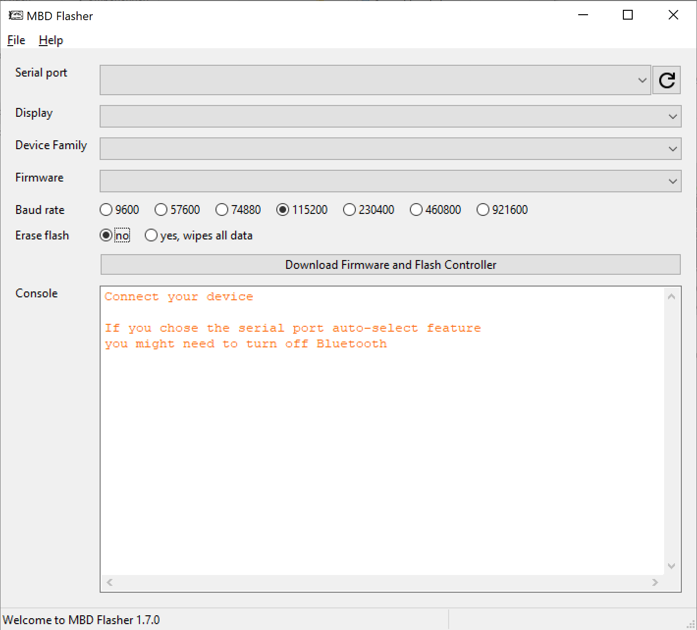
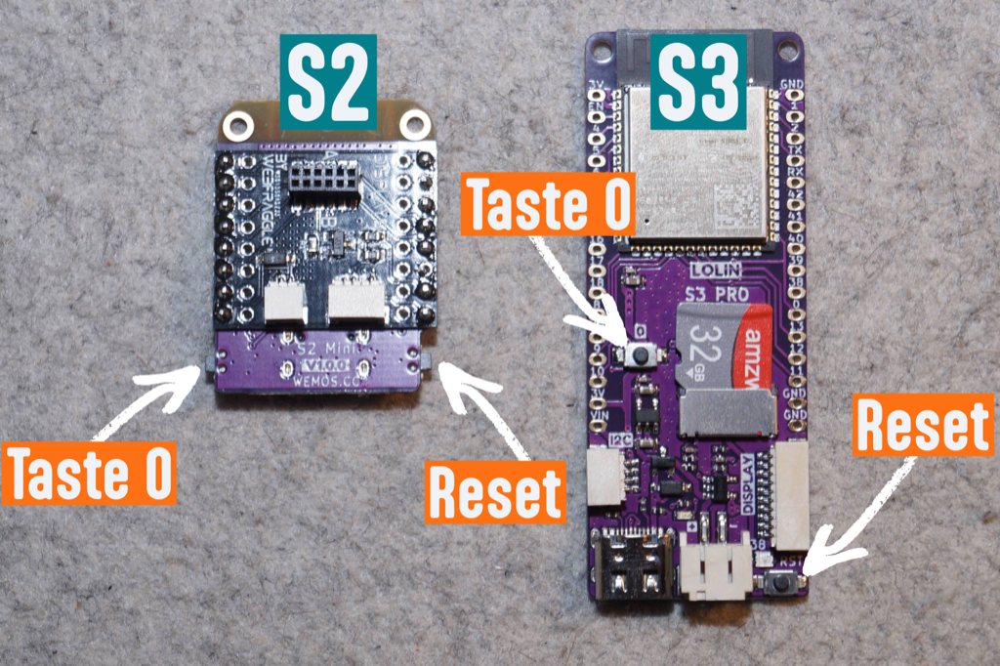
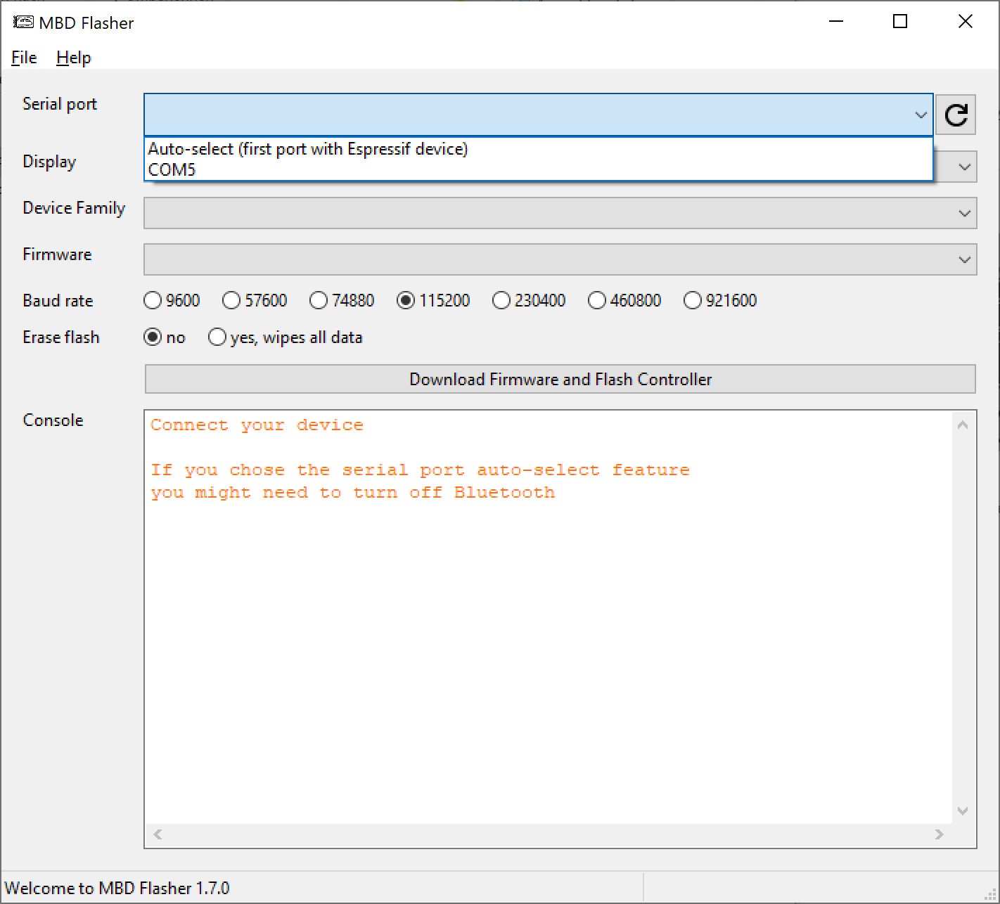
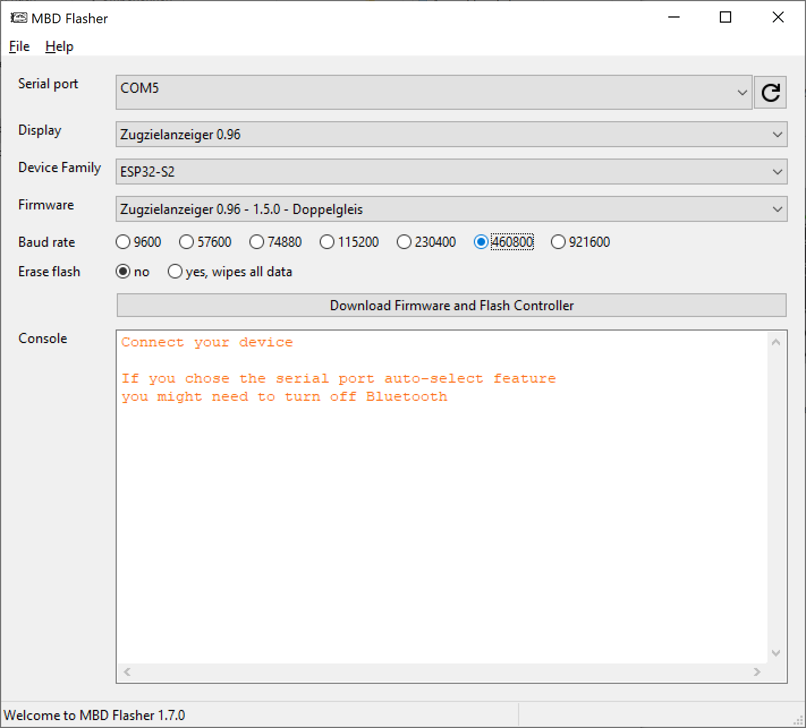
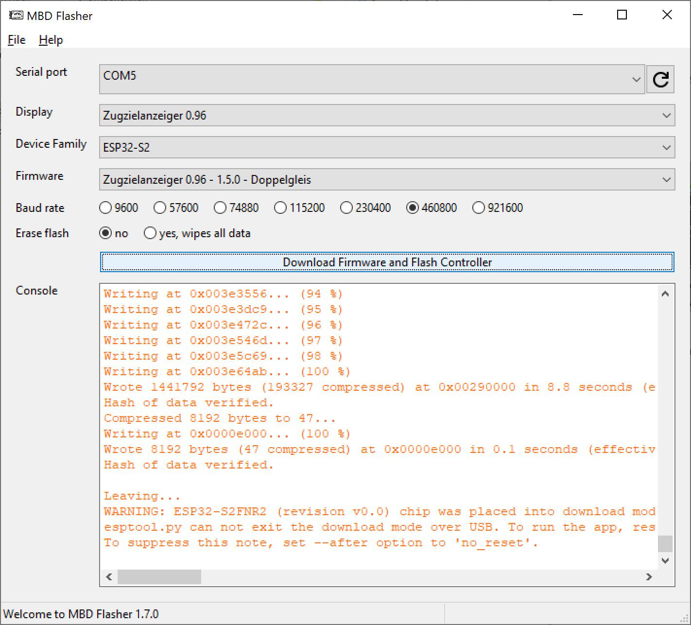

# Controller aktualisieren (per USB)

Wenn das Update über WLAN nicht klappt — zum Beispiel weil der Controller nicht mehr erreichbar ist oder das Webinterface nicht startet — kannst du ihn per USB-C-Kabel direkt an einem Windows-PC aktualisieren. Dieser Weg funktioniert auch dann noch, wenn auf dem Controller gar nichts mehr läuft.

## Inhalt
{: .no_toc .text-delta }

- TOC
{:toc}

---

## Was du brauchst

- Einen **Windows-PC**
- Ein **USB-C-Kabel**, das auch Daten überträgt (reine Ladekabel funktionieren nicht)
- Das Programm **MBD-Flasher**, kostenlos auf der [Download-Seite](https://www.modellbahn-displays.de/downloads/)

Die Firmware selbst musst du **nicht** herunterladen — das Programm holt sie sich selbst aus dem Internet. Dein PC muss dafür online sein.

> **Hinweis:** Auf der Download-Seite liegt der MBD-Flasher als Windows-Programm. Für den Mac gibt es eine Version auf Anfrage — schreib dazu einfach eine kurze Nachricht über das Kontaktformular auf [modellbahn-displays.de](https://www.modellbahn-displays.de/).

> **Achtung:** Bei diesem Update gehen **alle Einstellungen verloren**. Notiere dir vorher deine wichtigsten Einstellungen. Je nach Display und Firmware-Version gibt es im Webinterface auch eine Sicherungs-Funktion, mit der du deine Konfiguration vorher als Datei speichern kannst.

> **Tipp:** Wenn dein Controller noch über WLAN erreichbar ist, ist der Weg über den Browser deutlich einfacher — siehe [Controller aktualisieren (über WLAN)](controller-aktualisieren-wlan.md).

---

## MBD-Flasher starten

Lade das Programm herunter und starte es. Es öffnet sich ein Fenster mit mehreren Auswahlfeldern, die zunächst alle leer sind:

Unten im Bereich **Console** zeigt dir das Programm während der Arbeit an, was gerade passiert. Dort steht am Anfang der Hinweis „Connect your device" (Schließe dein Gerät an).

---

## Controller anschließen und in den Flash-Modus bringen

Trenne den Controller zuerst von seiner normalen Stromversorgung. Er wird beim Aktualisieren allein über das USB-Kabel mit Strom versorgt.

Schließe ihn dann mit dem USB-C-Kabel an deinen PC an.

Damit der Controller eine neue Firmware annimmt, muss er in den **Flash-Modus** versetzt werden. In diesem Zustand wartet er auf neue Software, statt sein normales Programm zu starten. Das machst du mit zwei Tasten auf dem Controller:

1. Drücke die Taste **BTN 0** und **halte sie gedrückt** (auf der Platine und im Bild unten ist sie als **Taste 0** beschriftet)
2. Drücke währenddessen einmal kurz die Taste **Reset** und lass sie wieder los
3. Lass jetzt auch **BTN 0** los

Wo die beiden Tasten sitzen, hängt von deinem Controller ab. Auf dem Bild siehst du links die kleinere **S2**-Variante, rechts die größere **S3**-Variante:

Äußerlich passiert dabei nichts Sichtbares — das Display bleibt dunkel. Das ist richtig so.

---

## Seriellen Port auswählen

Der **serielle Port** ist die Verbindung, über die dein PC mit dem Controller spricht. Unter Windows heißt er `COM` und eine Nummer, zum Beispiel `COM5`.

1. Klicke im Programm auf den Button mit dem **Kreispfeil** rechts neben **Serial port**. Damit sucht das Programm neu nach angeschlossenen Geräten.
2. Klappe die Liste **Serial port** auf. Dort taucht jetzt der Anschluss deines Controllers auf.
   
3. Wähle den `COM`-Eintrag aus. Bei dir kann eine andere Nummer stehen als im Bild.

> **Tipp:** Es gibt auch den Eintrag **Auto-select**, bei dem das Programm den Anschluss selbst sucht. Falls das fehlschlägt, schalte am PC probeweise Bluetooth aus — Bluetooth belegt ebenfalls serielle Anschlüsse und bringt die automatische Suche durcheinander. Sicherer ist es, den `COM`-Eintrag direkt auszuwählen.

---

## Display und Firmware auswählen

1. Wähle unter **Display** dein Display aus.
2. Das Feld **Device Family** füllt sich daraufhin von selbst (`ESP32-S2` oder `ESP32-S3`). Hier musst du nichts einstellen.
3. Wähle unter **Firmware** die Version aus, die du aufspielen möchtest — im Normalfall die neueste.

Die **Baud rate** stellst du im nächsten Schritt ein — im Bild steht sie schon auf dem richtigen Wert.

---

## Firmware aufspielen

1. Stelle die **Baud rate** auf **460800**. Das ist die Übertragungsgeschwindigkeit zum Controller; nach dem Start steht sie auf 115200 und muss umgestellt werden.
2. Lass **Erase flash** auf **no** stehen.
3. Klicke auf den Button **Download Firmware and Flash Controller**.

Das Programm lädt jetzt die Firmware herunter und überträgt sie auf den Controller. Im Bereich **Console** läuft der Fortschritt mit — das dauert einige Minuten.

> **Hinweis:** Zieh während des Vorgangs auf keinen Fall das Kabel ab. Fertig ist der Vorgang, wenn keine neuen Zeilen mehr dazukommen und am Ende eine englische Meldung mit **WARNING** erscheint. Diese Warnung ist kein Fehler — was es damit auf sich hat, steht im nächsten Abschnitt.

---

## Controller neu starten

Nach dem Aufspielen startet der Controller **nicht** von selbst neu — er bleibt im Flash-Modus stehen. In der Console erscheint dazu ein englischer Hinweis, dass das Programm den Modus nicht selbst verlassen kann. Das ist kein Fehler.

Drücke einfach kurz die Taste **Reset** am Controller. Danach startet er normal mit der neuen Firmware.

Da alle Einstellungen zurückgesetzt wurden, musst du anschließend das WLAN neu einrichten — siehe [WLAN einrichten](wlan-einrichten.md).

---

## Problembehebung

| Problem | Lösung |
|---|---|
| Kein `COM`-Eintrag in der Liste | Drücke den Kreispfeil-Button erneut. Hilft das nicht, prüfe das Kabel — viele USB-C-Kabel übertragen nur Strom und keine Daten |
| Automatische Port-Suche findet nichts | Schalte am PC Bluetooth aus oder wähle den `COM`-Eintrag von Hand aus |
| Programm meldet, dass kein Gerät gefunden wurde | Der Controller ist nicht im Flash-Modus. Wiederhole: **BTN 0** gedrückt halten, kurz **Reset** drücken, dann **BTN 0** loslassen |
| Übertragung bricht mittendrin ab | Stelle die **Baud rate** auf einen niedrigeren Wert (z.B. 115200) und versuche es erneut |
| Display bleibt nach dem Flashen dunkel | Drücke kurz die Taste **Reset** am Controller — er startet nach dem Update nicht von allein |
| Nichts hilft | Wähle bei **Erase flash** die Option **yes, wipes all data** und flashe erneut. Damit wird der Speicher vorher komplett gelöscht |
