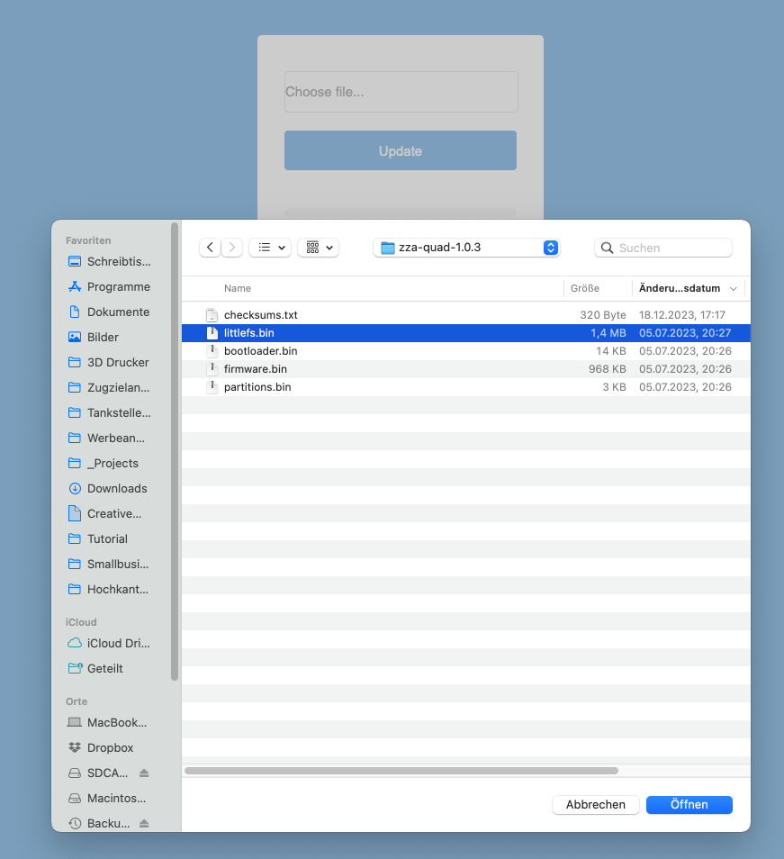
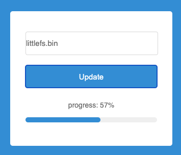
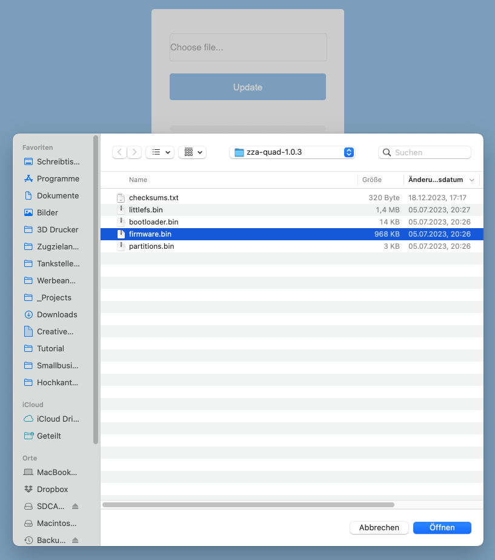

# Controller aktualisieren (über WLAN)

Von Zeit zu Zeit gibt es eine neue Firmware für deinen Controller — mit neuen Funktionen oder Fehlerbehebungen. Die Firmware ist das Programm, das im Controller läuft. Diese Anleitung zeigt dir, wie du sie bequem über dein Heim-WLAN und den Browser aktualisierst. Du brauchst dafür kein Kabel — nur ein Gerät, das im selben WLAN hängt wie dein Display.

## Inhalt
{: .no_toc .text-delta }

- TOC
{:toc}

---

## Was du vorher wissen solltest

Der Speicher des Controllers ist in zwei Bereiche aufgeteilt, die **getrennt voneinander** aktualisiert werden:

- **Dateisystem** (Datei `littlefs.bin`) — hier liegen die Webseiten des Webinterfaces und deine Einstellungen
- **Firmware** (Datei `firmware.bin`) — das eigentliche Programm des Controllers

Du lädst also nacheinander **zwei Dateien** hoch. Halte diese Reihenfolge unbedingt ein: erst das Dateisystem, dann die Firmware.

> **Achtung:** Beim Aktualisieren des Dateisystems werden **alle Einstellungen zurückgesetzt** — auch deine WLAN-Zugangsdaten. Notiere dir vorher deine wichtigsten Einstellungen. Je nach Display und Firmware-Version gibt es im Webinterface auch eine Sicherungs-Funktion, mit der du deine Konfiguration vorher als Datei speichern und hinterher wieder einspielen kannst.

---

## Was du brauchst

- Ein Smartphone, Tablet oder einen Computer, der **im selben WLAN** hängt wie dein Display
- Die heruntergeladene und entpackte Firmware (siehe nächster Abschnitt)

> **Tipp:** Prüfe am Smartphone kurz, ob es wirklich im Heim-WLAN ist und nicht über Mobilfunk surft. Über das Mobilfunknetz ist der Controller nicht erreichbar.

---

## Firmware herunterladen und entpacken

1. Öffne die Download-Seite: [modellbahn-displays.de/downloads](https://www.modellbahn-displays.de/downloads/)
2. Lade die Firmware für dein Display herunter. Du bekommst eine ZIP-Datei (ein zusammengepacktes Archiv mit mehreren Dateien).
3. Entpacke das ZIP-Archiv. Unter Windows klickst du es mit der rechten Maustaste an und wählst **Alle extrahieren**, am Mac genügt ein Doppelklick. Auf Smartphone und Tablet tippst du die Datei in der Dateien-App an — sie wird dann in einen gleichnamigen Ordner entpackt.

> **Hinweis:** Achte darauf, dass du die Firmware für genau deine Display-Variante lädst — bei manchen Displays gibt es mehrere Ausführungen (z.B. Einzelgleis und Doppelgleis). Die Bezeichnung steht im Dateinamen des Downloads. Im Zweifel schau auf deiner Bestellbestätigung nach oder frag kurz nach.

Im entpackten Ordner findest du mehrere Dateien, zum Beispiel `checksums.txt`, `bootloader.bin` und `partitions.bin`. Davon brauchst du nur diese beiden:

- `littlefs.bin`
- `firmware.bin`

Die übrigen Dateien lässt du einfach liegen.

---

## Update-Seite im Browser öffnen

Du brauchst die IP-Adresse deines Controllers — eine Art Hausnummer im Heimnetzwerk. Drücke kurz die Taste **BTN 0** am Controller, dann wird sie auf dem Display angezeigt (z.B. `192.168.178.41`). Ausführlich steht das unter [IP-Adresse herausfinden](wlan-einrichten.md#ip-adresse-herausfinden).

Am einfachsten kommst du über das Webinterface hin: Öffne die Startseite deines Displays im Browser und klicke auf **Controller-Upgrade** (beim Video-Display heißt der Knopf **Firmware aktualisieren**).

Du erreichst die Seite auch direkt über die Adresszeile — das funktioniert unabhängig davon, wie das Menü gerade aufgebaut ist. Gib dazu die Adresse deines Controllers ein, gefolgt von `/ota`:

```
http://192.168.178.41/ota
```

Setze statt `192.168.178.41` natürlich die IP-Adresse deines eigenen Controllers ein.

---

## Schritt 1: Dateisystem aktualisieren

1. Klicke auf der Update-Seite auf das Feld **Choose file…** und wähle die Datei `littlefs.bin` aus dem entpackten Ordner aus.
   {: style="max-width: 70%;" }
2. Klicke auf **Update**. Der Upload startet, und du siehst einen Fortschrittsbalken mit Prozentanzeige.
   {: style="max-width: 50%;" }
3. Warte, bis der Balken 100 % erreicht hat. Der Controller startet danach von selbst neu.

> **Hinweis:** Schalte den Controller während des Updates auf keinen Fall aus und schließe den Browser-Tab nicht. Warte auch dann ab, wenn die Seite kurz nicht mehr reagiert — das ist normal.

---

## Zwischenschritt: WLAN neu einrichten

Weil beim Dateisystem-Update auch die WLAN-Zugangsdaten gelöscht wurden, ist der Controller jetzt **nicht mehr in deinem Heim-WLAN**. Er öffnet stattdessen wieder sein eigenes Netzwerk.

**Bevor du mit Schritt 2 weitermachen kannst, musst du das WLAN neu einrichten** — wie das geht, steht unter [WLAN einrichten](wlan-einrichten.md). Erst danach ist der Controller wieder über dein Heim-WLAN erreichbar.

> **Hinweis:** Nach der Neueinrichtung kann der Controller eine **andere IP-Adresse** haben als vorher. Drücke deshalb noch einmal kurz **BTN 0** und notiere dir die neu angezeigte Adresse.

---

## Schritt 2: Firmware aktualisieren

1. Rufe die Update-Seite erneut auf — also noch einmal die IP-Adresse deines Controllers gefolgt von `/ota`, zum Beispiel `http://192.168.178.41/ota`
2. Klicke wieder auf **Choose file…**, diesmal wählst du die Datei `firmware.bin` aus.
   {: style="max-width: 70%;" }
3. Klicke auf **Update** und warte wieder, bis der Fortschrittsbalken durchgelaufen ist.
4. Der Controller startet neu — jetzt mit der neuen Firmware.

Fertig. Wenn auf dem Display wieder das Startbild erscheint und die LED grün leuchtet, ist das Update abgeschlossen.

> **Tipp:** Bei neueren Firmware-Versionen wird die installierte Versionsnummer im Webinterface angezeigt. Dort kannst du nachsehen, ob wirklich die neue Version läuft. Bei älteren Versionen gibt es diese Anzeige noch nicht.

Zum Schluss richtest du deine Einstellungen wieder ein, die beim Dateisystem-Update zurückgesetzt wurden.

---

## Problembehebung

| Problem | Lösung |
|---|---|
| Update-Seite lässt sich nicht öffnen | Drücke **BTN 0** am Controller und prüfe die angezeigte IP-Adresse. Achte darauf, dass `http://` und nicht `https://` davorsteht |
| Nach dem Dateisystem-Update ist der Controller nicht mehr erreichbar | Das ist normal — die WLAN-Daten wurden gelöscht. Richte das WLAN neu ein, siehe [WLAN einrichten](wlan-einrichten.md) |
| Upload bricht ab oder bleibt stehen | Gehe mit dem Smartphone oder Computer näher an den Router und starte den Upload erneut. Bei schlechtem WLAN-Empfang brechen Uploads häufig ab |
| Display bleibt nach dem Update dunkel | Trenne den Controller kurz von der Stromversorgung und schalte ihn wieder ein. Hilft das nicht, spiele die Firmware per USB neu auf, siehe [Controller aktualisieren (per USB)](controller-aktualisieren-usb.md) |
| Update über WLAN klappt gar nicht | Aktualisiere den Controller stattdessen per USB-Kabel am PC, siehe [Controller aktualisieren (per USB)](controller-aktualisieren-usb.md) |
