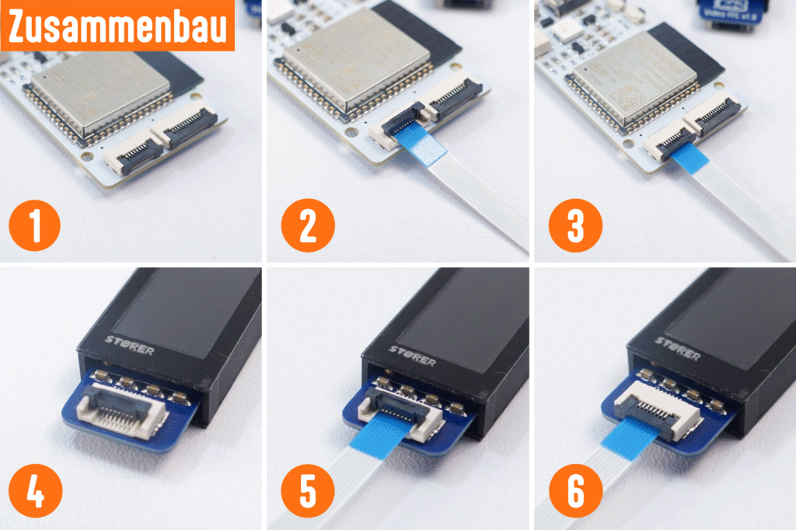

# Flachbandkabel anschließen

Das Flachbandkabel (FFC) verbindet den Controller mit dem Display. Der Anschluss ist bei allen Displays mit dem neuen Controller gleich.

## Inhalt
{: .no_toc .text-delta }

- TOC
{:toc}

---

## Übersicht

Das Flachbandkabel hat auf beiden Seiten einen flachen Stecker. An jedem Anschluss (Controller und Display) befindet sich eine kleine Klappe, die du vorsichtig öffnen und schließen musst.

---

## Schritt für Schritt

### Am Controller (Schritt 1–3)

1. **Klappe öffnen** — Klappe die kleine schwarze Verriegelung am Flachbandkabel-Anschluss des Controllers vorsichtig nach oben (Schritt 1).
2. **Kabel einstecken** — Schiebe das Flachbandkabel mit der blanken Kontaktseite (die Seite mit den sichtbaren Metallstreifen) nach unten in den Anschluss. Das Kabel sollte ohne Kraft hineingleiten (Schritt 2).
3. **Klappe schließen** — Drücke die Verriegelung vorsichtig wieder nach unten, bis sie einrastet. Das Kabel sitzt jetzt fest (Schritt 3).

### Am Display (Schritt 4–6)

{:start="4"}
4. **Klappe öffnen** — Klappe die Verriegelung am Flachbandkabel-Anschluss des Displays vorsichtig nach oben (Schritt 4).
5. **Kabel einstecken** — Schiebe das andere Ende des Flachbandkabels mit der Kontaktseite nach unten in den Anschluss (Schritt 5).
6. **Klappe schließen** — Drücke die Verriegelung wieder nach unten, bis sie einrastet (Schritt 6).

> **Tipp:** Wende beim Öffnen und Schließen der Klappen keine Gewalt an. Die Verriegelungen sind klein und empfindlich. Wenn sich das Kabel nicht leicht einschieben lässt, prüfe ob die Klappe wirklich ganz offen ist.

---

## IN und OUT bei Display-Platinen

Manche Display-Platinen haben zwei FFC-Anschlüsse, die mit **IN** und **OUT** beschriftet sind. Schließe das Kabel vom Controller immer an **IN** an.

> **Hinweis:** Bei den Zugzielanzeigern ist die Beschriftung schwer zu lesen. Dort erkennst du die richtige Seite daran, dass sich **IN** auf der Seite mit dem Buchstaben **B** befindet.

---

## Problembehebung

| Problem | Lösung |
|---|---|
| Display bleibt dunkel | Prüfe, ob das Kabel auf beiden Seiten richtig eingesteckt und die Klappen geschlossen sind |
| Flackerndes oder verzerrtes Bild | Kabel sitzt nicht richtig — nochmal öffnen und sauber einstecken |
| Kabel lässt sich nicht einstecken | Prüfe, ob die Klappe ganz offen ist und das Kabel richtig herum eingelegt wird |
