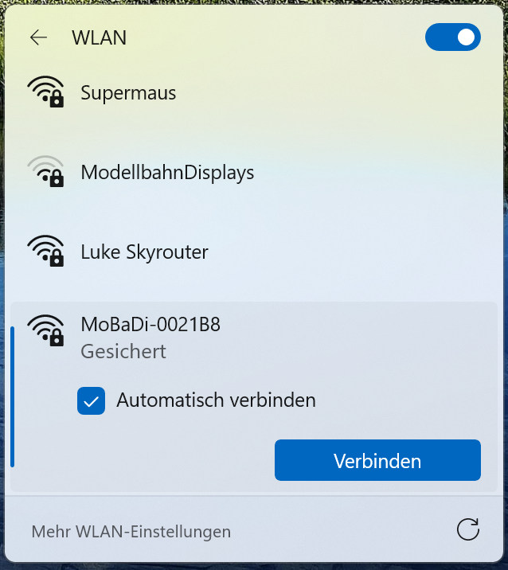
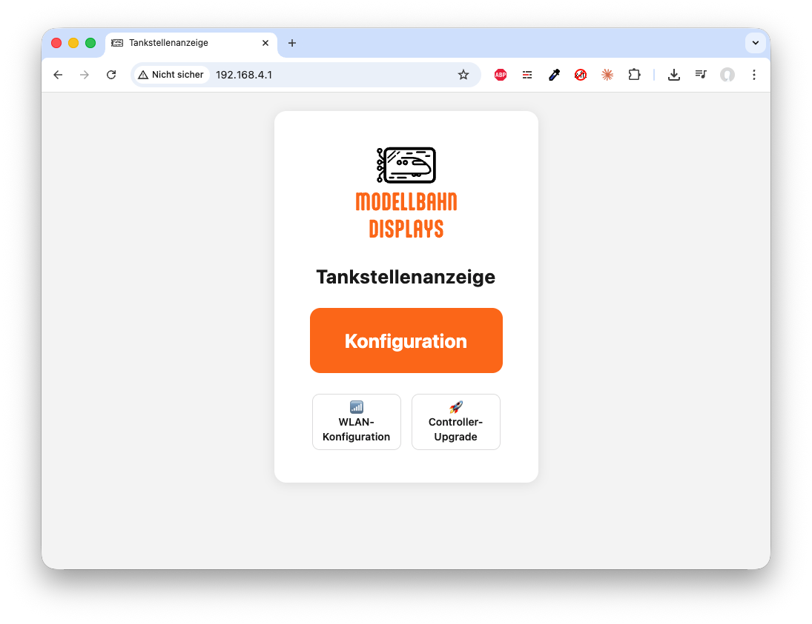
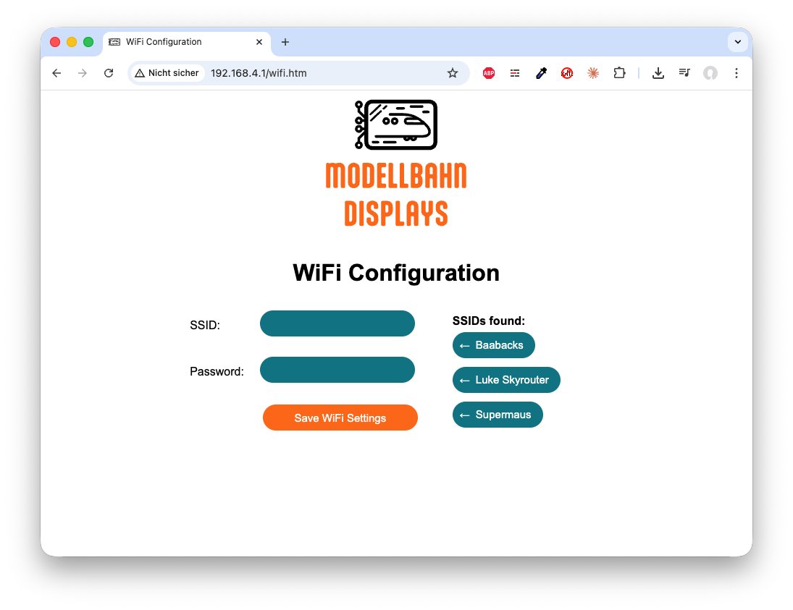

# WLAN einrichten

Diese Anleitung beschreibt, wie du dein Display mit deinem Heim-WLAN verbindest. Die Schritte sind bei allen Displays gleich.

## Inhalt
{: .no_toc .text-delta }

- TOC
{:toc}

---

## So funktioniert die WLAN-Einrichtung

Beim ersten Einschalten (oder wenn keine WLAN-Daten gespeichert sind) erstellt dein Display ein eigenes WLAN-Netzwerk. Die Zugangsdaten werden auf dem Display angezeigt, wenn du kurz die Taste **BTN 0** am Controller drückst:

- **WLAN-Name:** MoBaDi-XXXXXX (die Zeichen sind bei jedem Controller anders)
- **Passwort:** MoBaDi_XXXXXX

## Schritt für Schritt

1. Verbinde dich mit deinem Smartphone oder Computer mit dem WLAN deines Displays (Name und Passwort stehen auf dem Display). Unter Windows findest du die WLAN-Auswahl in der Taskleiste:
   {: style="max-width: 50%;" }
2. Öffne einen Browser (z.B. Chrome, Safari oder Firefox) und gib oben in die Adressleiste `192.168.4.1` ein. Du siehst die Startseite des Webinterfaces (die Einstellungsseite deines Displays im Browser):
   
3. Klicke auf **WLAN-Konfiguration**. Du siehst jetzt die WLAN-Einstellungen:
   
4. Rechts unter **SSIDs found** (gefundene WLAN-Netzwerke) werden die verfügbaren Netzwerke angezeigt. Klicke auf dein Heim-WLAN — der Name wird automatisch in das Feld **SSID** übernommen.
5. Gib im Feld **Password** das Passwort deines WLANs ein.
6. Klicke auf **Save WiFi Settings**.
7. Das Display startet neu und verbindet sich mit deinem WLAN.

> **Hinweis:** Falls dein WLAN nicht in der Liste auftaucht, kannst du den Netzwerknamen (SSID) auch von Hand in das Eingabefeld eintippen. Die Liste wird nicht automatisch aktualisiert.

---

## LED-Status

Die LED am Controller zeigt dir den Verbindungsstatus an:

- **Blau** — Controller startet
- **Lila** — WLAN-Konfigurationsmodus (eigenes Netzwerk aktiv)
- **Grün** — Mit WLAN verbunden
- **Rot** — Keine Verbindung

---

## WLAN-Daten ändern

Es gibt drei Wege, um die WLAN-Einstellungen zu ändern:

### Über die Reset-Taste

Drücke die **Reset**-Taste am Controller mehrfach kurz hintereinander (2–3 Mal). Dadurch werden die gespeicherten WLAN-Daten gelöscht und der Controller startet im Konfigurationsmodus — das heißt, er öffnet sein eigenes WLAN-Netzwerk, über das du die Einstellungen ändern kannst.

> **Hinweis:** Zwischen den Tastendrücken musst du jeweils 1–2 Sekunden warten, damit der Controller zwischendurch hochfahren kann. Erst dann erkennt er den nächsten Reset als Teil der Sequenz.

### Automatisch bei fehlendem WLAN

Wenn der Controller dein gespeichertes WLAN nicht findet (z.B. weil sich der Netzwerkname oder das Passwort geändert hat), wechselt er automatisch in den Konfigurationsmodus und öffnet sein eigenes Netzwerk.

### Über das eigene Netzwerk des Controllers

Solange der Controller im Konfigurationsmodus ist und sein eigenes WLAN sendet, kannst du dich damit verbinden und unter `192.168.4.1` die WLAN-Einstellungen direkt ändern — genau wie bei der Ersteinrichtung.

---

## IP-Adresse herausfinden

Sobald das Display mit deinem WLAN verbunden ist, bekommt es eine IP-Adresse (eine Art Hausnummer in deinem Netzwerk). Diese brauchst du, um das Webinterface zu öffnen.

Drücke kurz die Taste **BTN 0** am Controller — auf dem Display wird die aktuelle IP-Adresse angezeigt (z.B. `192.168.178.41`).

Gib diese Adresse in einem Browser auf deinem Computer oder Smartphone ein.

---

## Problembehebung

| Problem | Lösung |
|---|---|
| Kein WLAN-Netzwerk sichtbar | Tippe den Netzwerknamen (SSID) von Hand in das Eingabefeld ein |
| Webinterface nicht erreichbar | Drücke die Taste **BTN 0** am Controller, um die IP-Adresse auf dem Display anzuzeigen |
