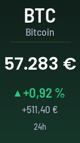
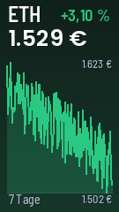
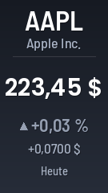
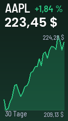

# Markt — Bild-Adresse erstellen

Der Markt-Bildgenerator unter `markt.yuv.de` erzeugt aus einer Internet-Adresse (einer **URL**) ein fertiges Kursbild im Format deines Displays — entweder für eine **Kryptowährung** (z.B. Bitcoin) oder für eine **Aktie** (z.B. SAP). Du musst nichts installieren: Du stellst dir die passende Adresse zusammen, und der Generator liefert ein fertiges PNG-Bild zurück.

Auf dieser Seite geht es nur darum, **wie du dir diese Adresse zusammenstellst und im Browser prüfst**. Wie du die fertige Adresse später in deinem Display hinterlegst, steht in der Anleitung zu deinem jeweiligen Display.

Der wichtigste Unterschied vorab:

- **Kryptowährung:** funktioniert sofort, ganz ohne Anmeldung.
- **Aktie:** du brauchst einen eigenen, kostenlosen **Schlüssel** (einen sogenannten API-Schlüssel — dazu unten mehr).

## Inhalt
{: .no_toc .text-delta }

- TOC
{:toc}

---

## So ist eine Adresse aufgebaut

Eine **URL** ist die Adresse, die du oben in die Adressleiste deines Browsers eingibst. Sie beginnt immer mit der Basis-Adresse des Generators:

```
https://markt.yuv.de/
```

Dahinter hängst du nach einem Fragezeichen die einzelnen **Parameter** an — das sind Einstellungen in der Form `name=wert`, die mit einem `&` voneinander getrennt werden. Damit legst du fest, was angezeigt werden soll.

Ein erstes Beispiel zum Ausprobieren — kopiere es einfach in die Adressleiste deines Browsers:

```
https://markt.yuv.de/?type=crypto&symbol=bitcoin&vs=eur&layout=quote
```

> **Tipp:** Probiere jede Adresse zuerst im Browser am Computer oder Smartphone aus. Wenn dort das richtige Bild erscheint, funktioniert sie auch auf dem Display.

---

## Kryptowährung anzeigen

Für Kryptowährungen brauchst du **keinen** Schlüssel. Du gibst nur an, welche Münze in welcher Währung angezeigt werden soll.

Beispiel für Bitcoin in Euro:

```
https://markt.yuv.de/?type=crypto&symbol=bitcoin&vs=eur&layout=quote
```

Die wichtigen Parameter dabei:

- **type** = `crypto` (Kryptowährung). Das ist die Voreinstellung — du kannst es bei Krypto auch weglassen.
- **symbol** = die Kennung der Münze (siehe unten).
- **vs** = die Zielwährung, in der der Kurs angezeigt wird. Voreinstellung ist `eur` (Euro), du kannst z.B. auch `usd` für US-Dollar angeben.

### Die richtige Münz-Kennung (symbol) finden

Bei Krypto ist **symbol** **nicht** das geläufige Kürzel wie „BTC", sondern die sogenannte CoinGecko-Coin-**ID** — eine eindeutige Kennung in Kleinbuchstaben. So findest du sie:

1. Öffne die Seite [coingecko.com](https://www.coingecko.com/) in deinem Browser.
2. Suche dort nach deiner Münze, z.B. „Bitcoin".
3. Schau dir die Adresse der Münzen-Seite an, z.B. `coingecko.com/de/coins/bitcoin`.
4. Der **letzte Teil** dieser Adresse ist die ID — hier also `bitcoin`.

Häufige Beispiele:

| Münze | symbol (ID) |
|---|---|
| Bitcoin | `bitcoin` |
| Ethereum | `ethereum` |
| Dogecoin | `dogecoin` |

> **Hinweis:** Verwende immer die kleingeschriebene ID (`bitcoin`), nicht das Börsenkürzel (`BTC`). Mit dem Kürzel findet der Generator die Münze nicht.

---

## Aktie anzeigen

Für Aktien brauchst du einen eigenen, kostenlosen **API-Schlüssel** (engl. „API-Key"). Das ist ein persönliches Passwort, mit dem der Kursanbieter erkennt, dass die Abfrage von dir kommt. Der Generator hat bewusst **keinen** eigenen Schlüssel hinterlegt — ohne deinen Schlüssel gibt es also keinen Kurs.

### Schritt 1: Kostenlosen Schlüssel besorgen (Alpha Vantage)

Standardanbieter für Aktien ist **Alpha Vantage**. Dieser kann auch deutsche Aktien liefern.

1. Öffne die Seite [alphavantage.co/support/#api-key](https://www.alphavantage.co/support/#api-key) in deinem Browser.
2. Trage dort deine E-Mail-Adresse ein und fordere einen kostenlosen Schlüssel an.
3. Du erhältst sofort eine Zeichenfolge aus Buchstaben und Zahlen — das ist dein **apikey**. Kopiere ihn dir.

> **Wichtig:** Dein Schlüssel steht offen in der Adresse. Teile diese Adresse deshalb nicht öffentlich (z.B. in Foren oder sozialen Netzwerken). Ein kostenloser Schlüssel ist allerdings ungefährlich: Er kann nur Kurse lesen, ist in der Anzahl der Abrufe begrenzt und lässt sich jederzeit neu erzeugen.

> **Hinweis:** Der kostenlose Zugang erlaubt nur etwa **25 Abrufe pro Tag** je Schlüssel. Für ein Display, das den Kurs nur ab und zu aktualisiert, reicht das problemlos.

### Schritt 2: Den richtigen Ticker (symbol) wählen

Bei Aktien ist **symbol** der **Ticker** — das Börsenkürzel der Aktie.

- **Deutsche Aktien** (gehandelt über **Xetra**, den elektronischen Handelsplatz der Deutschen Börse) bekommen die Endung (das sogenannte „Suffix") `.DEX` direkt an den Ticker angehängt. Der Kurs erscheint dann in Euro. Beispiele: `SAP.DEX`, `BMW.DEX`.
- **US-Aktien** gibst du ohne Suffix an, z.B. `AAPL` für Apple.

### Schritt 3: Adresse zusammenbauen

Beispiel für die SAP-Aktie (Xetra, in Euro) mit Verlaufsdiagramm. Ersetze `DEIN_KEY` durch deinen eigenen Schlüssel aus Schritt 1:

```
https://markt.yuv.de/?type=stock&symbol=SAP.DEX&layout=chart&apikey=DEIN_KEY
```

Die wichtigen Parameter:

- **type** = `stock` (Aktie). Das musst du hier immer angeben.
- **symbol** = der Ticker, z.B. `SAP.DEX` oder `AAPL`.
- **apikey** = dein persönlicher Schlüssel (Pflicht bei Aktien).

### Alternative Quelle: Twelve Data (experimentell)

Neben Alpha Vantage gibt es als zweite Kursquelle **Twelve Data** (vor allem für US-Aktien). Du hängst dafür den Parameter **src** an und nutzt einen eigenen Twelve-Data-Schlüssel — diesen bekommst du nach kostenloser Anmeldung auf [twelvedata.com](https://twelvedata.com/):

```
https://markt.yuv.de/?type=stock&src=twelvedata&symbol=AAPL&apikey=DEIN_KEY
```

Der Parameter **src** steuert die Aktien-Quelle: `alphavantage` (Voreinstellung) oder `twelvedata`.

> **Hinweis:** Twelve Data ist noch **experimentell** und bislang nicht vollständig getestet. Für den zuverlässigen Betrieb nimm Alpha Vantage — das liefert sowohl deutsche Aktien (Xetra) als auch US-Aktien.

---

## Layouts

Mit dem Parameter **layout** legst du fest, wie das Bild aussieht. Es gibt zwei Layouts:

- **quote** (Voreinstellung) — zeigt den aktuellen Kurs groß im Mittelpunkt, dazu die prozentuale Änderung (grün bei Plus, rot bei Minus).
- **chart** — zeigt zusätzlich ein kleines Verlaufsdiagramm, an dem du die Kursentwicklung ablesen kannst.

{: style="max-width: 45%;" }
{: style="max-width: 45%;" }

Dasselbe funktioniert genauso für Aktien:

{: style="max-width: 45%;" }
{: style="max-width: 45%;" }

---

## Bildgröße wählen

Mit dem Parameter **size** stellst du die Bildgröße in Pixeln (Breite × Höhe) passend zu deinem Display ein:

- `135x240` — die Voreinstellung (1,14"-Display, z.B. in der Tankstellenanzeige).
- `120x240` — für das 1,05"-Display (im Werbedisplay verbaut).

Beispiel mit der schmaleren Größe:

```
https://markt.yuv.de/?type=crypto&symbol=ethereum&layout=chart&size=120x240
```

> **Hinweis:** Wenn du `size` weglässt, wird automatisch `135x240` verwendet. Welche Größe zu deinem Display gehört, steht in der Anleitung zu deinem jeweiligen Display — im Zweifel ist `135x240` die richtige Wahl.

---

## Kurze Adressen

Neben den oben gezeigten Adressen mit Fragezeichen gibt es auch eine kürzere, gut lesbare Schreibweise. Sie ist nach diesem Muster aufgebaut:

```
https://markt.yuv.de/<code>/<type>/<layout>/<symbol>
```

Der **code** am Anfang steht dabei für die Bildgröße und entspricht der Display-Diagonale in Zoll (`114` = 1,14", `105` = 1,05"):

| Code | Bildgröße | Display |
|---|---|---|
| **114** | 135 × 240 Pixel | 1,14" (z.B. Tankstellenanzeige) |
| **105** | 120 × 240 Pixel | 1,05" (Werbedisplay) |

Beispiele:

```
https://markt.yuv.de/114/crypto/chart/bitcoin
```

```
https://markt.yuv.de/114/crypto/quote/bitcoin?vs=usd
```

```
https://markt.yuv.de/114/stock/quote/SAP.DEX?apikey=DEIN_KEY
```

Zusätzliche Angaben wie den Schlüssel, **src** oder **vs** hängst du wie gewohnt hinten an — die erste mit einem `?`, jede weitere mit einem `&`. Bei Krypto z.B. `?vs=usd`, bei Aktien `?apikey=DEIN_KEY`.

---

## Parameter-Übersicht

| Parameter | Pflicht | Bedeutung |
|---|---|---|
| **type** | nein | `crypto` (Voreinstellung) oder `stock` (Aktie) |
| **symbol** | ja | Krypto: CoinGecko-ID (`bitcoin`). Aktie: Ticker (`SAP.DEX`, `AAPL`) |
| **apikey** | nur bei Aktien | Dein eigener, kostenloser Schlüssel (API-Key) |
| **src** | nein | Aktien-Quelle: `alphavantage` (Voreinstellung) oder `twelvedata` (experimentell) |
| **vs** | nein | Zielwährung bei Krypto, Voreinstellung `eur` |
| **layout** | nein | `quote` (Voreinstellung) oder `chart` |
| **size** | nein | `135x240` (Voreinstellung) oder `120x240` |

> **Hinweis:** Geht etwas schief — etwa eine falsche Eingabe, ein fehlender Schlüssel oder ein vorübergehender Ausfall des Kursanbieters — bekommst du kein kaputtes Bild, sondern ein gestaltetes Fehlerbild mit einem kurzen Hinweis. So bleibt dein Display immer lesbar.

---

## Problembehebung

| Problem | Lösung |
|---|---|
| Kein Kurs / Fehlerbild bei einer Aktie | Prüfe, ob du **apikey** angegeben hast und der Schlüssel korrekt kopiert wurde. Beachte das Tageslimit (ca. 25 Abrufe pro Tag bei Alpha Vantage) — warte ggf. bis zum nächsten Tag oder nutze einen neuen Schlüssel |
| Kryptowährung wird nicht gefunden | Verwende die CoinGecko-**ID** in Kleinbuchstaben (`bitcoin`), nicht das Kürzel (`BTC`). Die ID findest du am Ende der Adresse auf coingecko.com |
| Deutsche Aktie zeigt keinen oder einen falschen Kurs | Hänge bei Xetra-Aktien das Suffix `.DEX` an den Ticker an, z.B. `SAP.DEX` |
| Fehlerbild „API-Key fehlt" | Bei Aktien ist der **apikey** Pflicht — Krypto braucht keinen Schlüssel |
| Bild zu breit oder zu schmal | Stelle mit **size** die richtige Größe ein — **135x240** bzw. Code **114** für die Standardvariante, **120x240** bzw. Code **105** für die schmale Variante |

---

## Und jetzt aufs Display

Sobald deine Adresse im Browser das gewünschte Bild zeigt, ist sie fertig. Wie du diese Adresse anschließend in deinem Display hinterlegst, damit das Kursbild dort automatisch erscheint, beschreibt die Anleitung zu deinem jeweiligen Display.
