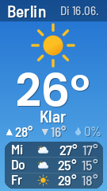
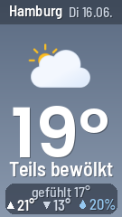
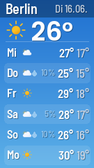
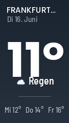

# Wetter — Bild-Adresse erstellen

Der Wetter-Bildgenerator erzeugt aus einer einfachen Internet-Adresse ein fertiges Wetterbild — schon im richtigen Format für dein Display. Du gibst eine deutsche Postleitzahl (PLZ) an, und der Dienst liefert ein hübsch gestaltetes Bild mit dem aktuellen Wetter und der Vorhersage zurück.

Diese Anleitung zeigt dir, **wie du dir die passende Adresse zusammenbaust und im Browser prüfst**. Das Bild wird als sogenanntes PNG ausgeliefert — das ist ein ganz normales Bildformat, wie es jeder Browser anzeigen kann.

## Inhalt
{: .no_toc .text-delta }

- TOC
{:toc}

---

## Die einfachste Adresse

Eine Internet-Adresse (auch **URL** genannt — die Zeile, die oben im Browser steht) besteht beim Wetter-Generator aus einer festen Basis und ein paar Angaben dahinter. Die Basis lautet immer:

```
https://wetter.yuv.de/
```

Damit ein Wetterbild herauskommt, hängst du mindestens deine Postleitzahl an. Die PLZ wird mit `?plz=` angegeben:

```
https://wetter.yuv.de/?plz=36145
```

Ersetze `36145` durch deine eigene Postleitzahl, kopiere die Adresse in die Adressleiste deines Browsers (z.B. Chrome, Safari oder Firefox) und drücke Enter. Du solltest sofort das Wetterbild für deinen Ort sehen.

> **Tipp:** Probiere die Adresse immer zuerst im Browser aus. Wenn dort das richtige Bild erscheint, funktioniert sie später auch auf deinem Display.

Die Zusätze hinter der Basis-Adresse nennt man **Parameter**. Der erste Parameter beginnt mit einem Fragezeichen `?`, jeder weitere mit einem Und-Zeichen `&`. So lassen sich mehrere Angaben kombinieren, zum Beispiel die PLZ und ein bestimmtes Layout:

```
https://wetter.yuv.de/?plz=36145&layout=now
```

(Was **layout** und **size** genau bedeuten, erfährst du in den nächsten beiden Abschnitten.)

> **Hinweis:** Die Postleitzahl muss genau aus **5 Ziffern** bestehen (eine führende 0 ist erlaubt, z.B. `01067` für Dresden). Gibst du eine ungültige oder unbekannte PLZ an, oder ist der Wetterdienst gerade nicht erreichbar, bekommst du kein kaputtes Bild, sondern ein gestaltetes Fehler-Bild mit einem kurzen Hinweis.

---

## Layouts

Mit dem Parameter **layout** wählst du aus, wie das Wetter dargestellt wird. Es gibt vier Layouts. Lässt du den Parameter weg, wird automatisch **now3day** verwendet.

### now3day — Jetzt + 3 Tage (Standard)

Zeigt das aktuelle Wetter groß im Bild (großes Wetter-Symbol und Temperatur), darunter die Höchst- und Tiefsttemperatur sowie die Regenwahrscheinlichkeit für heute — und dann die drei nächsten Tage als kompakte Liste. Der ausgewogene Allrounder.

{: style="max-width: 45%;" }

```
https://wetter.yuv.de/?plz=36145&layout=now3day
```

### now — Nur die aktuelle Lage

Der volle Fokus auf das Jetzt: sehr großes Wetter-Symbol, riesige aktuelle Temperatur und ein kleines Infofeld mit gefühlter Temperatur, Tages-Höchst- und Tiefstwert sowie Regenrisiko. **Ohne** Vorhersage für die Folgetage.

{: style="max-width: 45%;" }

```
https://wetter.yuv.de/?plz=20095&layout=now
```

### week — Wochenüberblick

Oben kompakt die aktuelle Lage, darunter eine Liste mit bis zu sechs Folgetagen — jeweils mit Wochentag, Wetter-Symbol, Regenwahrscheinlichkeit und Höchst-/Tiefsttemperatur. Ideal, wenn du die ganze Woche im Blick haben willst.

{: style="max-width: 45%;" }

```
https://wetter.yuv.de/?plz=80331&layout=week
```

### minimal — Sehr reduziert

Eine bewusst ruhige, typografische Variante: viel Weißraum, eine riesige Temperatur in der Mitte, ein kleines Symbol mit Zustandsbeschreibung und die nächsten Tage als eine einzige schlanke Zeile.

{: style="max-width: 45%;" }

```
https://wetter.yuv.de/?plz=36145&layout=minimal
```

---

## Bildgröße wählen

Mit dem Parameter **size** legst du die Bildgröße in Pixeln fest (Breite × Höhe). Sie sollte zur Auflösung deines Displays passen, damit das Bild ohne Ränder und ohne Verzerrung angezeigt wird. Es gibt zwei Größen:

| Größe | Display |
|---|---|
| `135x240` | 1,14"-Display (z.B. in der Tankstellenanzeige) |
| `120x240` | 1,05"-Display (im Werbedisplay verbaut) |

Lässt du **size** weg, wird automatisch `135x240` verwendet. Beispiel mit der schmaleren Größe:

```
https://wetter.yuv.de/?plz=36145&layout=now&size=120x240
```

> **Hinweis:** Welche Größe zu deinem Display gehört, steht in der Anleitung zu deinem jeweiligen Display. Im Zweifel ist `135x240` die richtige Wahl.

---

## Kurze Adressen

Neben der ausführlichen Schreibweise mit Parametern gibt es eine kürzere, aufgeräumtere Form. Statt die Angaben einzeln mit `?` und `&` anzuhängen, schreibst du sie direkt als Pfad hintereinander:

```
https://wetter.yuv.de/<code>/<layout>/<plz>
```

Dabei steht `<code>` für eine kurze Zahl, die für die Bildgröße steht. Der Code entspricht der Display-Diagonale in Zoll (`114` = 1,14", `105` = 1,05"):

| Code | Bildgröße | Display |
|---|---|---|
| **114** | 135 × 240 Pixel | 1,14" (z.B. Tankstellenanzeige) |
| **105** | 120 × 240 Pixel | 1,05" (Werbedisplay) |

Ein vollständiges Beispiel — Layout **now** in der Größe 135 × 240 für die PLZ 36145:

```
https://wetter.yuv.de/114/now/36145
```

Das ist genau dasselbe wie `https://wetter.yuv.de/?plz=36145&layout=now&size=135x240`, nur kürzer zu schreiben und zu merken. Du kannst frei wählen, welche der beiden Formen du verwendest.

---

## Parameter-Übersicht

| Parameter | Pflicht | Beschreibung |
|---|---|---|
| **plz** | ja | Deutsche Postleitzahl, genau 5 Ziffern (führende 0 erlaubt). |
| **layout** | nein | Darstellung: `now3day` (Standard), `now`, `week` oder `minimal`. Unbekannte Angabe → es wird `now3day` verwendet. |
| **size** | nein | Bildgröße: `135x240` (Standard) oder `120x240`. |

---

## Problembehebung

| Problem | Lösung |
|---|---|
| Bild zeigt eine Fehlermeldung („PLZ ungültig" / „PLZ unbekannt") | Prüfe die Postleitzahl — sie muss genau 5 Ziffern haben und zu einem deutschen Ort gehören. |
| Bild zeigt „Wetter n. verfügbar" (= Wetter nicht verfügbar) oder „Standort-Fehler" | Der Wetterdienst war kurz nicht erreichbar. Lade die Adresse nach ein paar Minuten erneut. |
| Bild ist leer oder lädt nicht | Teste die komplette Adresse zuerst im Browser. Achte darauf, dass `https://wetter.yuv.de/` korrekt davor steht und keine Leerzeichen in der Adresse sind. |
| Es wird immer das Standard-Layout angezeigt | Prüfe die Schreibweise bei **layout** (`now3day`, `now`, `week`, `minimal`) — bei einem Tippfehler wird auf `now3day` zurückgefallen. |
| Bild passt nicht aufs Display (Ränder oder Verzerrung) | Wähle die Größe passend zum Display: **135x240** bzw. Code **114** für die Standardvariante, **120x240** bzw. Code **105** für die schmale Variante. |

---

Sobald die Adresse im Browser das gewünschte Wetterbild zeigt, ist sie fertig. Wie du diese Adresse anschließend in deinem Display hinterlegst, wird in der Anleitung zu deinem jeweiligen Display beschrieben.
