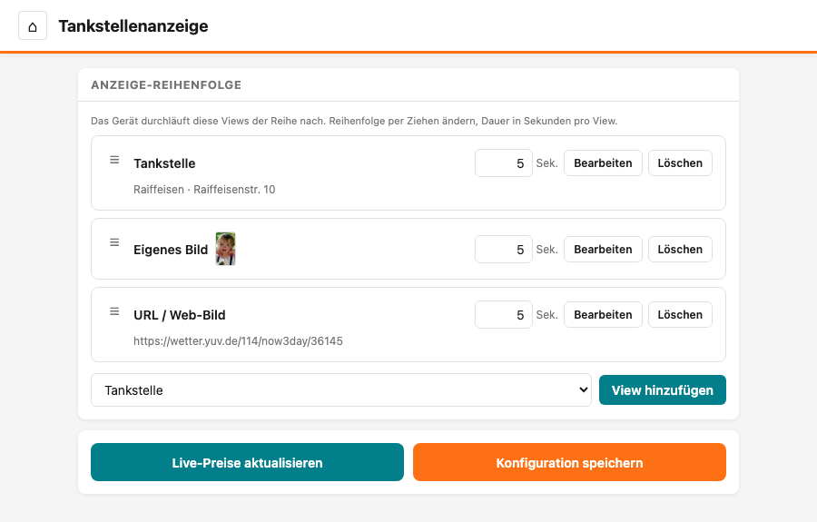

# Tankstellenanzeige — Einrichtung & Bedienung

Diese Anleitung beschreibt die Ersteinrichtung und die Konfiguration der Preisanzeige.

> **Hinweis:** Die Tankstellenanzeige kann inzwischen mehr als nur Tankstellenpreise zeigen — sie kann nacheinander mehrere Inhalte durchlaufen (z. B. Wetter, Börsenkurse, eigene Bilder). Diese Seite erklärt die **Preisanzeige**. Wie du weitere Inhalte ergänzt, steht unter [Anzeige-Reihenfolge](anzeige-reihenfolge.md).

## Inhalt
{: .no_toc .text-delta }

- TOC
{:toc}

---

## Anschluss und erster Start

Prüfe, dass das Flachbandkabel zwischen Controller und Display richtig eingesteckt ist (siehe [Flachbandkabel anschließen](../allgemein/flachbandkabel-anschliessen.md)). Verbinde den Controller per USB-C-Kabel mit einer Stromquelle (USB-Netzteil oder Powerbank). Nach wenigen Sekunden erscheint das Startbild auf dem Display und die LED am Controller leuchtet.

> **Tipp:** Willst du den Controller stattdessen mit einem Modellbahn-Trafo oder einem 12V-DC-Netzteil betreiben, benötigst du den als Zubehör erhältlichen Spannungswandler, der an den 2-Pin-Stromeingang des Controllers angeschlossen wird.

---

## WLAN einrichten und IP-Adresse herausfinden

Die WLAN-Einrichtung ist bei allen Displays gleich. Die vollständige Anleitung findest du unter [WLAN einrichten](../allgemein/wlan-einrichten.md).

---

## Das Webinterface und das Menü

Öffne im Browser die IP-Adresse deines Displays (z. B. `192.168.178.41`). Auf der Startseite findest du:

- **Konfiguration** — die Anzeige einrichten (Preise, Inhalte, Einstellungen)
- **WLAN-Konfiguration** — WLAN-Zugangsdaten ändern
- **Controller-Upgrade** — Software des Controllers aktualisieren (Firmware-Update)

Auf allen Seiten gibt es unten links ein **Menü-Symbol** (drei Striche). Ein Klick darauf öffnet das Menü, über das du jederzeit zwischen **Startseite**, **Konfiguration**, **Backup & Restore**, **WLAN-Konfiguration** und **Controller-Upgrade** wechseln kannst.

Klicke auf **Konfiguration**. Du siehst die **Anzeige-Reihenfolge** — die Liste der Inhalte, die das Display nacheinander zeigt. Direkt nach dem Kauf steht dort ein einziger Eintrag: **Tankstelle**. Das ist deine Preisanzeige.

---

## Die Tankstellen-Einstellungen öffnen

Alle Einstellungen der Preisanzeige (Design, Tankstelle, Preise, Zeilen) stecken im Eintrag **Tankstelle**. Klicke in dessen Zeile auf **Bearbeiten** — es öffnet sich ein Fenster mit allen folgenden Einstellungen. Wenn du fertig bist, klickst du im Fenster unten auf **Übernehmen** und anschließend auf der Hauptseite auf **Konfiguration speichern**.

> **Tipp:** Du kannst auch **mehrere Tankstellen** nacheinander anzeigen — jede ist ein eigener Eintrag mit eigenen Einstellungen (Design, ID, Preise, Zeilen). Wie du weitere hinzufügst, steht unter [Mehrere Tankstellen](anzeige-reihenfolge.md#mehrere-tankstellen).

---

## Template wählen

Unter **Template** (Vorlage) findest du eine Liste aller verfügbaren Anzeige-Designs (z. B. Aral, Shell, LED). Wähle das Template, das zu deiner Tankstelle passt.

---

## Tankstelle auswählen (Tankstellen-ID)

Damit Live-Preise einer bestimmten Tankstelle angezeigt werden, brauchst du deren **Tankstellen-ID**. Am einfachsten findest du sie über die eingebaute Suche:

1. Gib in das Feld **Tankstellen-ID** deine **Postleitzahl** ein (5 Ziffern).
2. Es klappt eine Liste der Tankstellen in der Umgebung auf. Mit dem Schieberegler **Umkreis** stellst du den Suchradius ein (1 bis 25 km).
3. Klicke deine Tankstelle in der Liste an — die ID und der Name werden automatisch übernommen.

> **Tipp:** Du kannst statt der Postleitzahl auch eine bereits bekannte Tankstellen-ID (langer Text aus Buchstaben, Zahlen und Bindestrichen) direkt in das Feld einfügen.

> **Hinweis:** Wird keine Tankstelle ausgewählt (Feld leer), werden die Preise nicht automatisch online aktualisiert. Du kannst sie dann nur von Hand eintragen.

---

## Preise einstellen

Im Bereich **Preise** siehst du alle Kraftstoffarten. Es gibt zwei Gruppen:

**Absolute Preise** (oberer Bereich):
- **e10** (Super E10), **e5** (Super), **diesel** (Diesel) — Hier stehen die tatsächlichen Preise (z. B. 1,85). Bei ausgewählter Tankstelle werden diese drei Preise automatisch online aktualisiert.

**Relative Preise** (unterer Bereich, unterhalb der Trennlinie):
- **superplus** (SuperPlus), **lkwdiesel** (LKW-Diesel), **erdgas** (Erdgas/CNG), **lpg** (Autogas), **adblue** (AdBlue) — Diese werden als Auf- oder Abschlag zu e10 berechnet. Beispiel: SuperPlus ist oft 10 Cent teurer als E10 — dann gibst du hier `+0,10` ein. Für LKW-Diesel, der 5 Cent günstiger ist, trägst du `-0,05` ein.

Die relativen Preise musst du nur einmal einstellen — danach werden sie automatisch anhand des aktuellen E10-Preises berechnet.

---

## Zeilen zuordnen

Im Bereich **Zeilen** legst du fest, welche Kraftstoffart in welcher Zeile auf dem Display angezeigt wird. Für jede der bis zu 6 Zeilen gibt es ein Auswahlfeld — wähle dort die gewünschte Kraftstoffart aus. Zeilen, die du nicht benötigst, lässt du einfach leer.

---

## Update-Intervall

Das **Intervall** legt fest, wie oft die Preise automatisch online abgerufen werden (in Minuten). Der Mindestwert ist 5 Minuten, um den Preisserver nicht zu überlasten. Das Intervall gilt geräteweit für **alle** Tankstellen gemeinsam — du findest das Feld zwar in jedem Tankstellen-Eintrag, der Wert wirkt aber überall gleich, egal wo du ihn änderst.

---

## Eigene Datenquelle (für Fortgeschrittene)

Das Feld **API-URL** (die Adresse eines eigenen Preisservers) kann normalerweise leer gelassen werden — die Tankstellenanzeige nutzt dann automatisch den richtigen Server. Nur wenn du einen eigenen Preisserver betreibst, trägst du hier dessen Adresse ein. Wie das Intervall gilt auch die API-URL geräteweit für **alle** Tankstellen gemeinsam. Details siehe [Eigene Datenquelle](api.md).

> **Wichtig:** Auch bei einer eigenen URL muss eine Tankstelle ausgewählt sein, damit die Preisabfrage funktioniert.

---

## Einstellungen speichern

Wenn du alle Einstellungen vorgenommen hast, klicke auf **Konfiguration speichern**. In der Statusleiste am unteren Rand erscheint **Gespeichert** und die Anzeige auf dem Display aktualisiert sich.

Mit dem Knopf **Live-Preise aktualisieren** kannst du jederzeit die neuesten Preise für **alle** Tankstellen-Einträge vom Server abrufen, ohne auf das nächste automatische Update zu warten.

---

## Weitere Inhalte und Sicherung

- Du möchtest neben den Preisen noch Wetter, Börsenkurse oder eigene Bilder anzeigen? Das richtest du über die [Anzeige-Reihenfolge](anzeige-reihenfolge.md) ein.
- Bevor du viel einstellst, lohnt sich eine Sicherung: Mit [Backup & Wiederherstellung](backup-restore.md) sicherst du deine komplette Konfiguration in einer Datei.

---

## Problembehebung

| Problem | Lösung |
|---|---|
| Display bleibt dunkel | Prüfe die Stromversorgung (USB-C-Kabel und Netzteil) sowie das Flachbandkabel zum Display |
| Preise werden nicht aktualisiert | Prüfe, ob eine Tankstelle ausgewählt ist und die WLAN-Verbindung steht (LED grün) |
| Falsche Preise angezeigt | Prüfe die ausgewählte Tankstelle im **Tankstelle**-Eintrag unter **Bearbeiten** |
| Ich finde die Einstellungen nicht mehr | Alle Preis-Einstellungen liegen im Eintrag **Tankstelle** → **Bearbeiten**. Zwischen den Seiten wechselst du über das **Menü** unten links |

> **Tipp:** Bei Problemen mit dem WLAN oder dem Webinterface schau in die allgemeine Anleitung [WLAN einrichten](../allgemein/wlan-einrichten.md).
