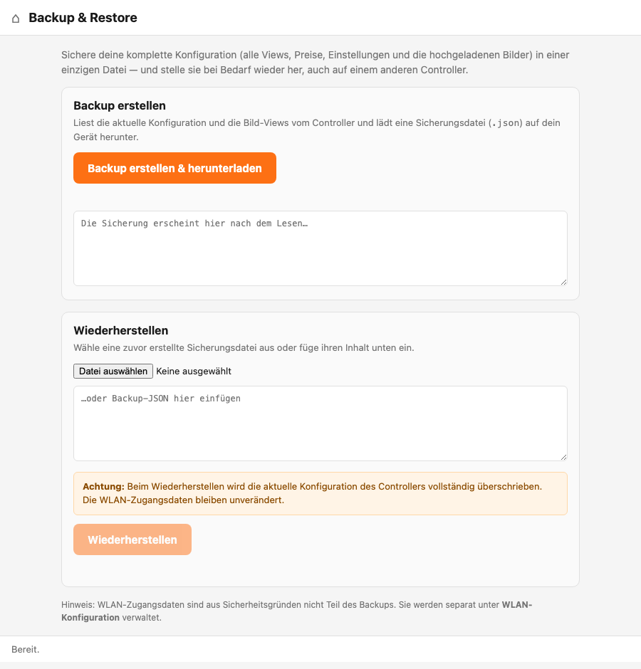

# Backup & Wiederherstellung

Mit dem Wachsen der Möglichkeiten (mehrere Inhalte, eigene Bilder, Wetter, Kurse)
lohnt sich eine **Sicherung**. Die Tankstellenanzeige speichert deine komplette
Konfiguration in einer einzigen Datei — und stellt sie bei Bedarf wieder her, auch
auf einem anderen Controller.

## Inhalt
{: .no_toc .text-delta }

- TOC
{:toc}

---

## Backup & Restore öffnen

Öffne über das **Menü** unten links den Punkt **Backup & Restore**. Du siehst zwei
Bereiche: oben **Backup erstellen**, darunter **Wiederherstellen**.

---

## Backup erstellen

1. Klicke auf **Backup erstellen & herunterladen**.
2. Die aktuelle Konfiguration und alle hochgeladenen Bilder werden vom Controller gelesen.
3. Dein Browser lädt eine Sicherungsdatei herunter — eine `.json`-Datei mit einem Namen wie `tankstellenanzeige-backup_192-168-178-41_2026-06-17.json`.

Bewahre diese Datei an einem sicheren Ort auf (Computer, Cloud, USB-Stick). Sie enthält alles, um deine Anzeige später wiederherzustellen.

> **Tipp:** Erstelle ein Backup, bevor du größere Änderungen ausprobierst — so kannst du jederzeit zum funktionierenden Stand zurückkehren.

---

## Wiederherstellen

> **Achtung:** Beim Wiederherstellen wird die **aktuelle** Konfiguration des Controllers vollständig **überschrieben**. Das lässt sich nicht rückgängig machen — erstelle im Zweifel vorher ein Backup des aktuellen Stands.

1. Klicke auf das **Datei-Auswahlfeld** (oben im Bereich Wiederherstellen) und wähle deine Sicherungsdatei (`.json`). Alternativ kannst du den Inhalt der Datei auch in das Textfeld einfügen.
2. Klicke auf **Wiederherstellen** und bestätige die Sicherheitsabfrage.
3. Zuerst werden die Bilder übertragen, danach die Konfiguration gespeichert. Den Fortschritt siehst du unter dem Knopf.
4. Anschließend übernimmt der Controller die wiederhergestellte Konfiguration automatisch.

---

## Was ist im Backup enthalten?

**Enthalten:** die komplette Konfiguration — alle Inhalte der Anzeige-Reihenfolge (siehe [Weitere Inhalte anzeigen](anzeige-reihenfolge.md)), die Tankstellen-Einstellungen (Tankstelle, Template, Preise, Zeilen, Intervall) sowie alle hochgeladenen **eigenen Bilder**.

**Nicht enthalten:** die **WLAN-Zugangsdaten**. Sie werden aus Sicherheitsgründen separat gespeichert und über die [WLAN-Konfiguration](../allgemein/wlan-einrichten.md) verwaltet. Nach einem Wiederherstellen auf einem anderen Controller richtest du dort das WLAN also einmalig neu ein.

---

## Auf einen anderen Controller übertragen

So überträgst du deine Einrichtung auf ein zweites Display:

1. Auf dem alten Controller: **Backup erstellen & herunterladen**.
2. Auf dem neuen Controller: zuerst [WLAN einrichten](../allgemein/wlan-einrichten.md), dann das Webinterface öffnen.
3. Unter **Backup & Restore** die zuvor erstellte Datei **wiederherstellen**.

---

## Problembehebung

| Problem | Lösung |
|---|---|
| „Keine gültige Tankstellenanzeige-Sicherung" | Die ausgewählte Datei ist kein Backup dieses Displays. Verwende eine mit `Backup erstellen` erzeugte `.json`-Datei. |
| Bilder fehlen nach dem Wiederherstellen | Stelle sicher, dass du die vollständige Sicherungsdatei verwendet hast (sie enthält die Bilder). Erstelle das Backup ggf. neu. |
| Nach dem Wiederherstellen kein WLAN | Das ist normal: WLAN-Daten sind nicht Teil des Backups. Richte das WLAN über die [WLAN-Konfiguration](../allgemein/wlan-einrichten.md) neu ein. |
| Der Knopf **Wiederherstellen** ist grau | Wähle zuerst eine Datei aus oder füge Backup-Text in das Feld ein. |
