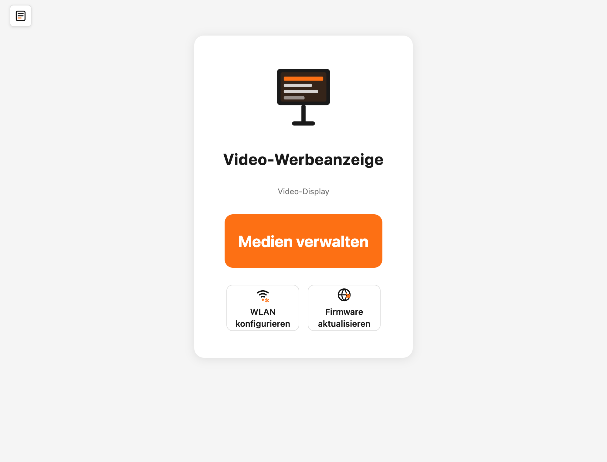

# Video-Controller in Betrieb nehmen

Diese Anleitung bringt dein Video-Display zum ersten Mal ans Laufen: anschließen, mit dem WLAN verbinden und die Weboberfläche öffnen, über die du später deine Inhalte verwaltest.

## Inhalt
{: .no_toc .text-delta }

- TOC
{:toc}

---

## Anschluss und erster Start

Prüfe zuerst, dass das flache Kabel (Flachbandkabel) zwischen Controller und Display richtig eingesteckt ist. Wie das geht, steht in der allgemeinen Anleitung [Flachbandkabel anschließen](../allgemein/flachbandkabel-anschliessen.md).

Verbinde den Controller anschließend über ein **USB-C-Kabel** mit einer Stromquelle — zum Beispiel einem USB-Netzteil vom Handy oder einer Powerbank. Nach ein paar Sekunden erscheint ein Startbild auf dem Display, und die kleine Leuchte (LED) am Controller leuchtet.

> **Tipp:** Willst du den Controller stattdessen mit einem Modellbahn-Trafo oder einem 12V-DC-Netzteil betreiben, benötigst du den als Zubehör erhältlichen Spannungswandler, der an den 2-Pin-Stromeingang des Controllers angeschlossen wird.

> **Hinweis:** Das Display braucht keinen eigenen Computer. Für die Einrichtung genügt ein Smartphone, Tablet oder Notebook, mit dem du ins WLAN kommst.

---

## Mit dem WLAN verbinden und die Adresse herausfinden

Damit du das Display bedienen kannst, verbindest du es mit deinem Heim-WLAN. Der Ablauf ist bei allen Displays gleich und in der allgemeinen Anleitung [WLAN einrichten](../allgemein/wlan-einrichten.md) Schritt für Schritt beschrieben. Dort steht auch, wie du die **Adresse** (IP-Adresse) deines Displays herausfindest — eine Zahlenfolge wie `192.168.178.41`, die du gleich im Browser brauchst.

---

## Die Weboberfläche öffnen

Gib die Adresse deines Displays in die Adresszeile deines Browsers ein (zum Beispiel `192.168.178.41`) und drücke die Eingabetaste. Es öffnet sich die Startseite der Weboberfläche.

Von hier aus erreichst du alles Wichtige:

- **Medien verwalten** — der große Knopf in der Mitte. Hier legst du fest, welche Bilder und Videos das Display zeigt. Das ist die Seite, auf der du die meiste Zeit arbeitest.
- **WLAN konfigurieren** — die WLAN-Zugangsdaten ändern, falls sich dein Netzwerk ändert.
- **Firmware aktualisieren** — die Software des Controllers auf den neuesten Stand bringen.

Oben links auf jeder Seite findest du ein **Menü-Symbol** (drei Striche). Ein Klick darauf öffnet ein Menü, über das du jederzeit zwischen **Startseite**, **Medien-Verwaltung**, **Video-Konverter**, **WLAN-Konfiguration** und dem **Firmware-Update** wechseln kannst.

> **Tipp:** Speichere die Adresse deines Displays als Lesezeichen im Browser. Dann musst du sie nicht jedes Mal neu eintippen.

---

## Weiter geht's: Inhalte einrichten

Ab Werk zeigt das Display ein Startbild. Deine eigenen Bilder und Videos richtest du über den Knopf **Medien verwalten** ein — wie das geht, steht auf der Seite [Medien verwalten](medien-verwalten.md).

Möchtest du ein Video anzeigen, muss es vorher in das passende Format umgewandelt werden. Das übernimmt der eingebaute [Video-Konverter](videos-konvertieren.md) direkt im Browser.

---

## Software aktualisieren

Von Zeit zu Zeit gibt es neue Funktionen oder Verbesserungen. Über den Knopf **Firmware aktualisieren** (im Menü heißt derselbe Punkt **Firmware-Update**) bringst du die Betriebssoftware — die **Firmware** — deines Controllers auf den neuesten Stand. Der genaue Ablauf ist bei allen Displays gleich und steht in der allgemeinen Anleitung [Controller aktualisieren (über WLAN)](../allgemein/controller-aktualisieren-wlan.md). Falls das über WLAN nicht klappt, gibt es den Weg [per USB am Windows-PC](../allgemein/controller-aktualisieren-usb.md).

---

## Problembehebung

| Problem | Lösung |
|---|---|
| Display bleibt dunkel | Prüfe die Stromversorgung (USB-C-Kabel und Netzteil) und ob das Flachbandkabel zum Display fest sitzt |
| Ich finde die Adresse des Displays nicht | Folge der Anleitung [WLAN einrichten](../allgemein/wlan-einrichten.md) — dort steht, wo du die Adresse abliest |
| Die Weboberfläche lädt nicht | Prüfe, ob dein Smartphone oder Computer im selben WLAN ist wie das Display, und tippe die Adresse ohne Tippfehler ein |
| WLAN-Verbindung klappt nicht mehr | Setze das WLAN zurück und richte es neu ein — siehe [WLAN zurücksetzen](../allgemein/wlan-resetten.md) |
