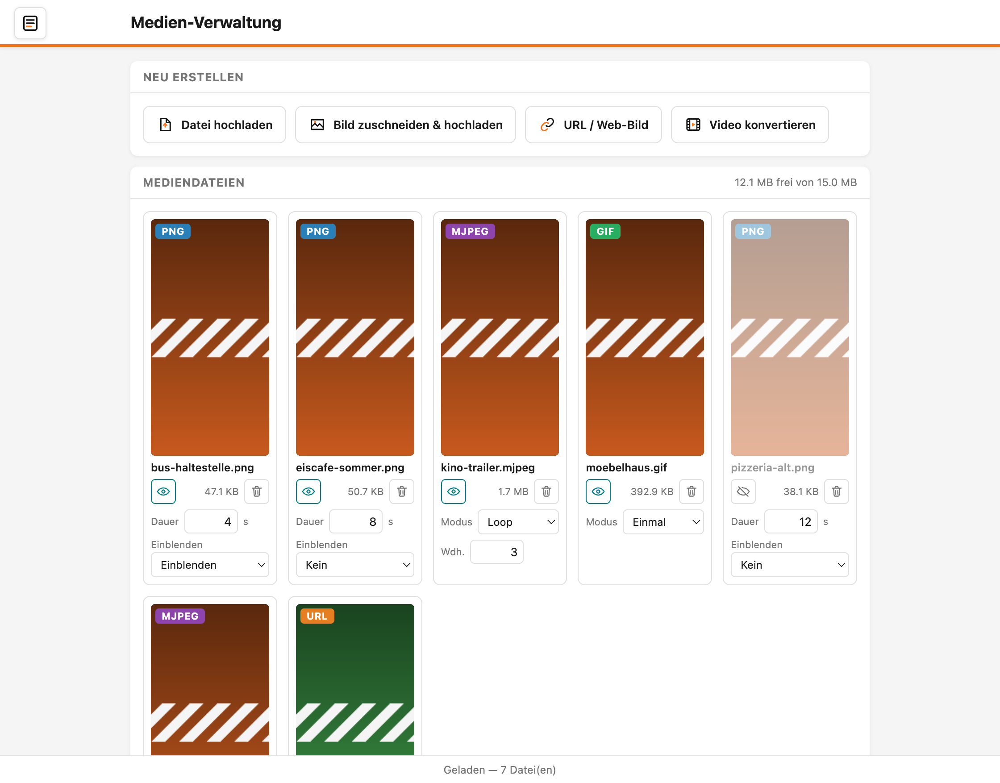
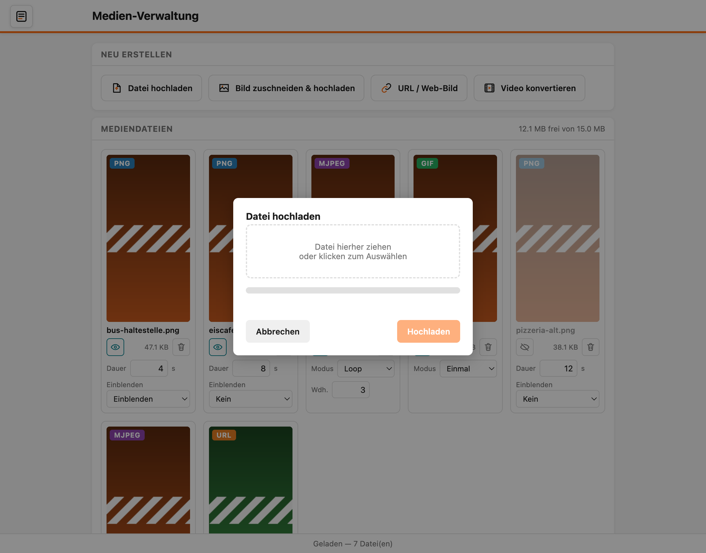
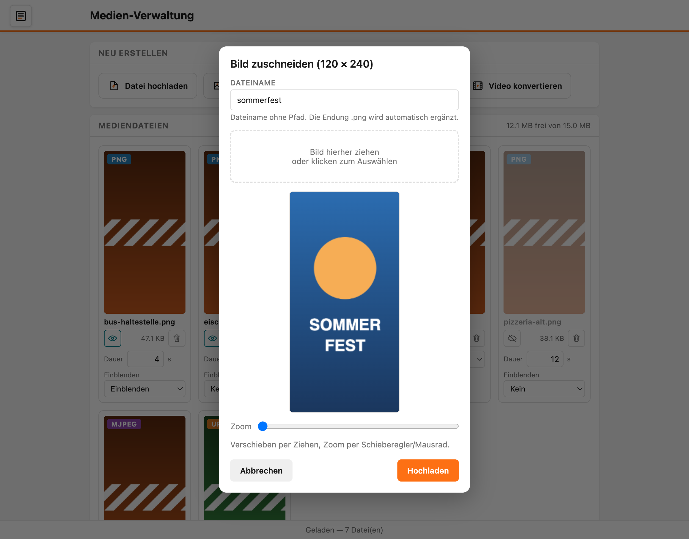

# Medien verwalten

Das Video-Display zeigt deine Inhalte nacheinander in einer Schleife — ein Bild, dann das nächste, dann ein Video und wieder von vorn. Diese Seite erklärt, wie du Inhalte hinzufügst, einstellst und für die Anzeige ein- oder ausschaltest.

## Inhalt
{: .no_toc .text-delta }

- TOC
{:toc}

---

## Die Medien-Verwaltung öffnen

Öffne die Weboberfläche deines Displays (siehe [Video-Controller in Betrieb nehmen](inbetriebnahme.md)) und klicke auf den großen Knopf **Medien verwalten**. Du kannst die Seite auch jederzeit über das **Menü-Symbol** oben links erreichen.

Die Seite besteht aus zwei Bereichen:

- **Neu erstellen** (oben) — vier Knöpfe, um neue Inhalte hinzuzufügen.
- **Mediendateien** (darunter) — jede vorhandene Datei als eigene Kachel. Rechts oben in diesem Bereich siehst du außerdem, wie viel Speicherplatz noch frei ist (zum Beispiel **12,1 MB frei von 15,0 MB**).

---

## Eine Kachel verstehen

Jeder Inhalt wird als Kachel dargestellt. Von oben nach unten enthält eine Kachel:

- Eine **Vorschau** des Inhalts, mit einem farbigen Abzeichen oben links, das den Dateityp anzeigt (**PNG**, **GIF**, **MJPEG** oder **URL** — was diese Typen bedeuten, steht unter [Datenformate und eigene Dateien](datenformate.md)).
- Den **Dateinamen**.
- Eine Reihe mit dem **Augen-Symbol** (aktiv/inaktiv), der **Dateigröße** und dem **Papierkorb** (Löschen).
- Darunter die **Einstellungen**, die zum jeweiligen Typ passen.

---

## Einen Inhalt sofort auf dem Display anzeigen

Klicke auf die **Vorschau** einer Kachel, um diesen Inhalt sofort auf dem Display anzuzeigen. So prüfst du direkt, wie ein Bild oder Video in echt aussieht, ohne die Schleife abzuwarten. Danach läuft die normale Schleife automatisch weiter.

> **Hinweis:** Nur aktive Inhalte lassen sich anzeigen. Ist ein Inhalt ausgeblendet (Augen-Symbol durchgestrichen), passiert beim Klick auf die Vorschau nichts.

---

## Einen Inhalt ein- oder ausblenden

Das **Augen-Symbol** schaltet einen Inhalt für die Schleife an oder aus:

- **Auge offen** — der Inhalt läuft in der Schleife mit.
- **Auge durchgestrichen** — der Inhalt wird übersprungen, bleibt aber gespeichert.

So kannst du einen Inhalt vorübergehend pausieren, ohne ihn zu löschen.

---

## Einstellungen pro Inhalt

Welche Einstellungen eine Kachel zeigt, hängt vom Dateityp ab.

**Bei Bildern (PNG) und Web-Bildern (URL):**

- **Dauer** — wie lange das Bild angezeigt wird, in Sekunden.
- **Einblenden** — hier wählst du, wie das Bild erscheint: **Kein** (ohne Effekt), **Einblenden** (sanftes Erscheinen), **Hochschieben**, **Runterschieben**, **Links** oder **Rechts**.

**Bei bewegten Inhalten (GIF und MJPEG):**

- **Modus** — wie oft der Clip läuft:
  - **Einmal** — der Clip läuft einmal ganz durch, dann kommt der nächste Inhalt.
  - **Zeit** — der Clip läuft für eine feste **Dauer** in Sekunden (und wiederholt sich in dieser Zeit, falls er kürzer ist).
  - **Loop** — der Clip läuft eine feste Anzahl **Wiederholungen**.
- **Wdh.** — die Anzahl der Wiederholungen (1 bis 255). Dieses Feld erscheint nur im Modus **Loop**.
- **Dauer** — die Anzeigedauer in Sekunden. Dieses Feld erscheint nur im Modus **Zeit**.

Änderungen werden sofort gespeichert; unten in der Statusleiste erscheint kurz **Gespeichert**.

> **Tipp:** Ein sehr kurzes GIF wirkt im Modus **Zeit** ruhiger, weil es sich innerhalb der eingestellten Sekunden mehrfach wiederholt, statt sofort weiterzuspringen.

---

## Neue Inhalte hinzufügen

Im Bereich **Neu erstellen** gibt es vier Wege, einen Inhalt hinzuzufügen.

### Datei hochladen

Für fertige Bilder und Videodateien im richtigen Format (**PNG**, **GIF** oder **MJPEG**). Ein Klick auf **Datei hochladen** öffnet ein Fenster mit einer gestrichelten Fläche.

Ziehe deine Datei in die Fläche oder klicke sie an, um eine Datei auszuwählen. Anschließend klickst du auf **Hochladen**. Ein Fortschrittsbalken zeigt, wie weit der Vorgang ist.

> **Hinweis:** Es lassen sich nur die Formate **.png**, **.gif** und **.mjpeg** hochladen. Eine Videodatei (zum Beispiel **.mp4**) musst du erst mit dem [Video-Konverter](videos-konvertieren.md) umwandeln.

### Bild zuschneiden & hochladen

Wenn ein Bild nicht genau ins Hochformat des Displays passt, hilft dieser Weg. Ein Klick auf **Bild zuschneiden & hochladen** öffnet einen kleinen Bild-Editor.

Gib oben einen **Dateinamen** ein, ziehe dann ein Bild in die Fläche (oder klicke sie an). Im Vorschaurahmen verschiebst du das Bild mit der Maus und zoomst mit dem Schieberegler **Zoom** oder dem Mausrad, bis der gewünschte Ausschnitt passt. Der Rahmen zeigt genau das, was später auf dem Display landet. Mit **Hochladen** wird der Ausschnitt passend zugeschnitten und als Bild gespeichert.

### URL / Web-Bild

Statt eine Datei zu speichern, kann das Display ein Bild bei jedem Durchlauf frisch aus dem Internet laden — zum Beispiel eine aktuelle Wetterkarte oder einen Börsenkurs. Ein Klick auf **URL / Web-Bild** öffnet ein Fenster, in dem du einen **Dateinamen** und die **Adresse (URL)** des Bildes einträgst.

Für fertige Wetter- und Marktbilder gibt es den Knopf **Vorlagen (Wetter, Aktien, Krypto)**. Er baut die passende Adresse für dich zusammen. Wie das im Detail funktioniert, steht unter [Bildgeneratoren](../bildgeneratoren/).

### Video konvertieren

Ein Klick auf **Video konvertieren** öffnet den [Video-Konverter](videos-konvertieren.md), der eine Videodatei direkt im Browser in das anzeigbare Format umwandelt. Sobald die Umwandlung fertig ist, kannst du das Ergebnis direkt hochladen; es erscheint dann als neue Kachel.

---

## Gleicher Name: überschreiben oder abbrechen

Lädst du einen Inhalt hoch, dessen Name schon vorhanden ist, fragt das Display sicherheitshalber nach. Du hast zwei Möglichkeiten:

- **Überschreiben** — die alte Datei wird durch die neue ersetzt.
- **Abbrechen** — es wird nichts geändert. Möchtest du die alte Datei behalten, benenne die neue Datei zuerst auf deinem Computer um (zum Beispiel `plakat-2.png`) und lade sie dann erneut hoch.

---

## Einen Inhalt löschen

Ein Klick auf den **Papierkorb** in einer Kachel entfernt den Inhalt dauerhaft. Zur Sicherheit erscheint vorher eine Rückfrage.

> **Tipp:** Reicht der Speicherplatz nicht mehr (Anzeige rechts oben im Bereich **Mediendateien**), lösche nicht mehr benötigte Inhalte oder nutze eine Speicherkarte — mehr dazu unter [Datenformate und eigene Dateien](datenformate.md).

---

## Problembehebung

| Problem | Lösung |
|---|---|
| Meine Datei lässt sich nicht hochladen | Prüfe das Format — hochladbar sind nur **.png**, **.gif** und **.mjpeg**. Videos zuerst mit dem [Video-Konverter](videos-konvertieren.md) umwandeln |
| Ein Inhalt erscheint nicht auf dem Display | Prüfe, ob das **Augen-Symbol** der Kachel offen ist (aktiv). Ausgeblendete Inhalte werden übersprungen |
| Das Wdh.- oder Dauer-Feld fehlt | Die Felder erscheinen je nach **Modus**: **Wdh.** nur bei **Loop**, **Dauer** nur bei **Zeit** |
| Kein Platz mehr für neue Inhalte | Lösche nicht benötigte Dateien oder verwende eine Speicherkarte (siehe [Datenformate und eigene Dateien](datenformate.md)) |
| Ein Web-Bild (URL) bleibt leer | Prüfe die Adresse im Browser — sie muss ein Bild liefern und mit `http://` oder `https://` beginnen |
