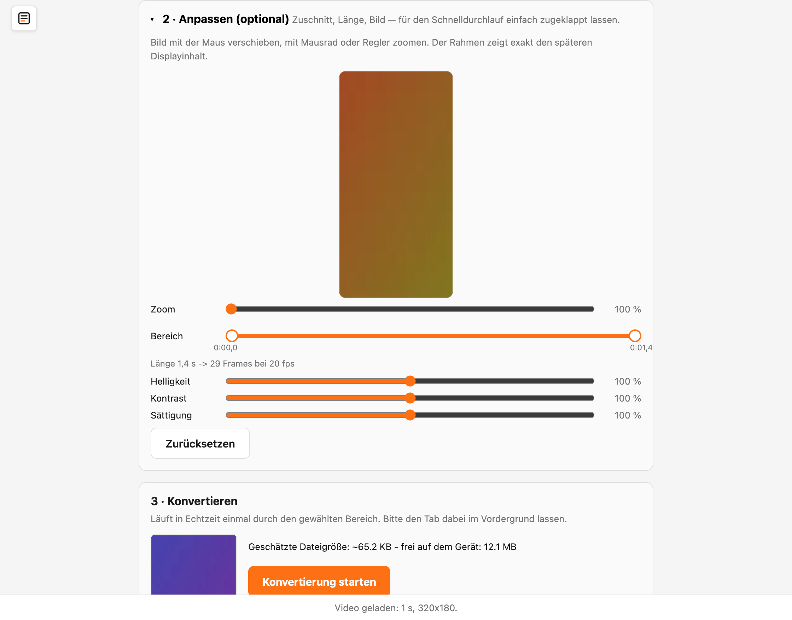
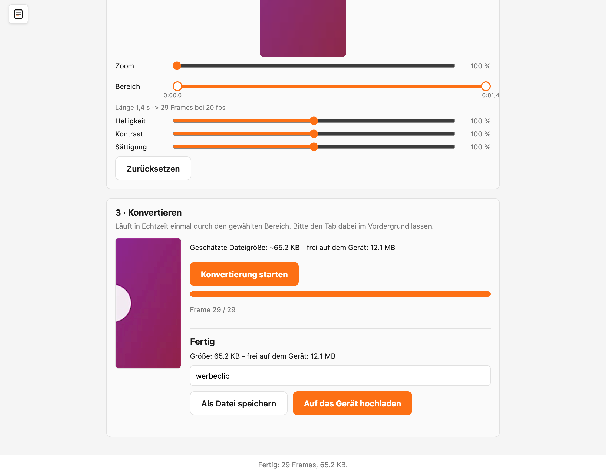

# Videos konvertieren

Das Display kann bewegte Videos zeigen — allerdings nur in einem besonderen Format namens **MJPEG**. Ein normales Handy- oder Kamera-Video (zum Beispiel eine **.mp4**-Datei) musst du deshalb einmal umwandeln. Das erledigt der eingebaute Video-Konverter direkt in deinem Browser.

## Inhalt
{: .no_toc .text-delta }

- TOC
{:toc}

---

## Wie die Umwandlung abläuft

Die Umwandlung passiert komplett auf deinem eigenen Gerät im Browser — dein Video wird **nicht ins Internet hochgeladen**. Aus dem Video entsteht eine MJPEG-Datei, die auf das Format und die Bildgröße deines Displays zugeschnitten ist.

> **Hinweis:** Der Konverter funktioniert nur in den Browsern **Google Chrome** und **Microsoft Edge**. In anderen Browsern kann die Umwandlung fehlschlagen.

---

## Den Konverter öffnen

Es gibt zwei Wege:

- In der [Medien-Verwaltung](medien-verwalten.md) auf **Video konvertieren** klicken — der Konverter öffnet sich als Fenster über der Seite.
- Oder oben links über das **Menü-Symbol** den Eintrag **Video-Konverter** wählen.

Der Ablauf ist in drei Schritte gegliedert.

---

## Schritt 1: Video wählen

Ziehe deine Videodatei in die gestrichelte Fläche oder klicke sie an, um eine Datei auszuwählen. Verwendbar ist alles, was dein Browser abspielen kann — üblicherweise **MP4**, **MOV** oder **WebM**.

---

## Schritt 2: Anpassen (optional)

Dieser Bereich ist eingeklappt, weil du ihn für einen schnellen Durchlauf nicht brauchst. Ein Klick auf **Anpassen (optional)** klappt ihn auf. Hier kannst du:

- **Bildausschnitt wählen** — das Video in der Vorschau mit der Maus verschieben und mit dem Regler **Zoom** oder dem Mausrad vergrößern. Der Rahmen zeigt genau den späteren Displayinhalt.
- **Länge kürzen (Trimmen)** — mit dem Doppel-Regler den **Anfang** und das **Ende** festlegen. So schneidest du zum Beispiel eine ruhige Stelle am Anfang weg. Darunter siehst du die gewählte Länge und die Anzahl der Bilder.
- **Bild anpassen** — mit den Reglern **Helligkeit**, **Kontrast** und **Sättigung** die Farben nachregeln.

Mit **Zurücksetzen** stellst du alle Anpassungen wieder auf den Ausgangszustand (voller Ausschnitt, volle Länge, normale Farben).

---

## Schritt 3: Konvertieren

Du siehst eine Vorschau des Ergebnisses und daneben die Bedienelemente. Klicke auf **Konvertierung starten**. Das Video läuft nun einmal in Echtzeit durch, während es Bild für Bild umgewandelt wird — ein Fortschrittsbalken zeigt den Stand.

> **Hinweis:** Lass den Browser-Tab während der Umwandlung im Vordergrund geöffnet und wechsle nicht zu einem anderen Tab. Sonst pausiert der Browser die Umwandlung.

Ist die Umwandlung fertig, siehst du die **Größe** der erzeugten Datei und wie viel Platz auf dem Display frei ist.

Jetzt hast du zwei Möglichkeiten:

- **Auf das Gerät hochladen** — die Datei landet direkt auf dem Display und erscheint als neue Kachel in der [Medien-Verwaltung](medien-verwalten.md).
- **Als Datei speichern** — die MJPEG-Datei wird auf deinem Computer gespeichert, falls du sie aufheben oder später hochladen möchtest.

---

## Problembehebung

| Problem | Lösung |
|---|---|
| Der Konverter reagiert nicht richtig | Verwende **Google Chrome** oder **Microsoft Edge** — in anderen Browsern funktioniert die Umwandlung nicht zuverlässig |
| „Dieses Format kann der Browser nicht abspielen" | Wandle das Video vorher in ein gängiges Format wie **MP4** um oder wähle eine andere Datei |
| Die Umwandlung bricht mittendrin ab | Lass den Browser-Tab im Vordergrund und wechsle während der Umwandlung nicht zu einem anderen Tab oder Programm |
| Die Datei ist zu groß für das Display | Kürze das Video im Bereich **Anpassen** (Anfang und Ende) auf einen kürzeren Ausschnitt |
