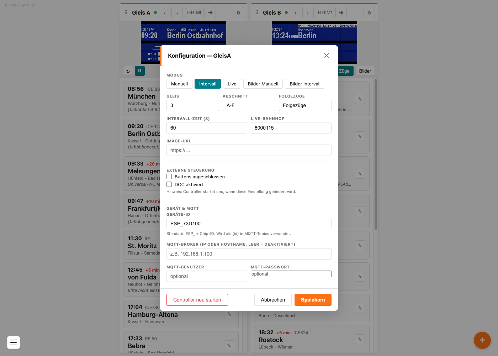
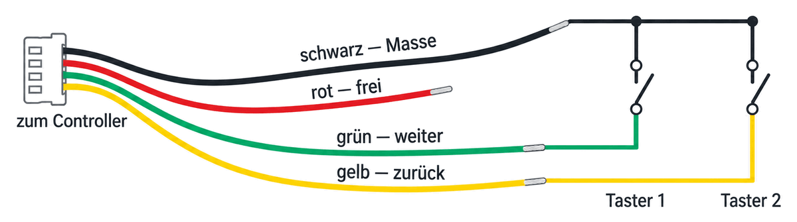
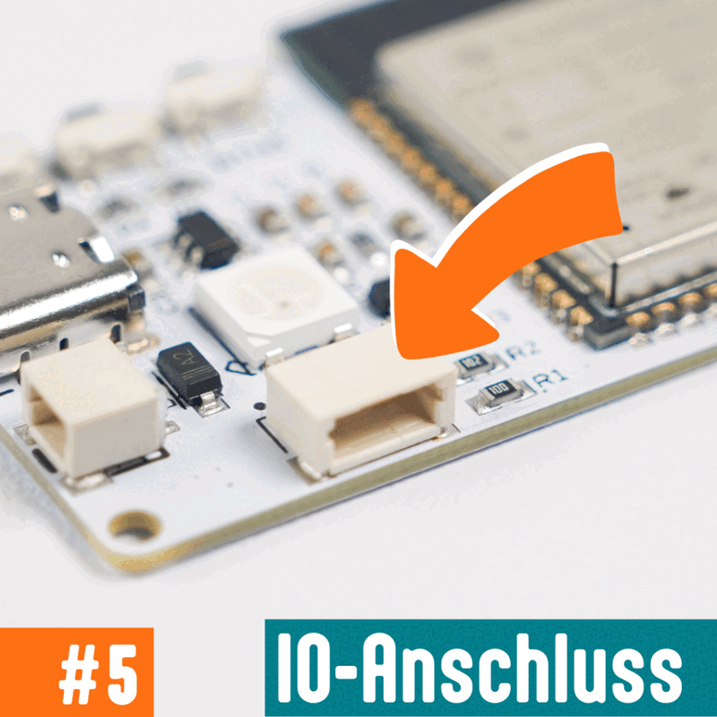

# Anzeigeart und Einstellungen

Die Anzeigeart bestimmt, ob der Anzeiger einen Zug stehen lässt, von selbst weiterschaltet, Fahrplandaten holt oder Bilder zeigt. Sie steht in der Konfiguration des Gleises, zusammen mit allen übrigen Einstellungen.

## Inhalt
{: .no_toc .text-delta }

- TOC
{:toc}

---

## Die Einstellungen öffnen

Klicke im Kopf der Kachel auf das Zahnrad **⚙**. Es öffnet sich das Fenster **Konfiguration — GleisA** (beziehungsweise *GleisB*).

Alle Einstellungen gelten **nur für dieses eine Gleis**. Beim Zugzielanzeiger für zwei Gleise stellst du Gleis A und Gleis B also getrennt ein.

Zum Schluss klickst du unten auf **Speichern**. **Abbrechen** verwirft alles.

---

## Die fünf Anzeigearten

Ganz oben wählst du die Anzeigeart:

| Anzeigeart | Was sie macht | Wofür |
|---|---|---|
| **Manuell** | Zeigt genau den Zug, den du ausgewählt hast, und wartet | Wenn du selbst bestimmst, was auf der Tafel steht — von Hand, per Taster, über DCC oder aus einem Steuerungsprogramm |
| **Intervall** | Schaltet von selbst alle paar Sekunden zum nächsten Zug und beginnt nach dem letzten wieder von vorn | Für den unbeaufsichtigten Dauerbetrieb auf der Anlage |
| **Live** | Holt alle 60 Sekunden echte Fahrplandaten aus dem Internet und zeigt die nächsten drei Züge | Wenn der Anzeiger den Fahrplan eines realen Bahnhofs übernehmen soll |
| **Bilder Manuell** | Zeigt ein Bild und wartet | Für selbst gestaltete Anzeigen, etwa im Stil einer anderen Bahn |
| **Bilder Intervall** | Wechselt von selbst alle paar Sekunden zum nächsten Bild | Für mehrere solcher Anzeigen nacheinander |

> **Hinweis:** In den Anzeigearten **Live** haben die Knöpfe **‹** und **›** keine Wirkung — welcher Zug zu sehen ist, bestimmt dort der Fahrplan. In allen anderen Anzeigearten kannst du jederzeit von Hand weiterschalten, auch im laufenden Intervallbetrieb.

Die beiden Bild-Anzeigearten sind unter [Bilder statt Züge anzeigen](bilder-anzeigen.md) beschrieben, der Live-Betrieb unter [Echte Fahrplandaten anzeigen](live-daten.md).

---

## Die Felder im Einzelnen

| Feld | Bedeutung |
|---|---|
| **Gleis** | Die Nummer des Bahnsteiggleises, zum Beispiel `3`. Im Live-Betrieb bestimmt dieser Wert, **welches Gleis** des Bahnhofs abgefragt wird |
| **Abschnitt** | Die Abschnittsbuchstaben des Bahnsteigs, zum Beispiel `A-F`. Wird nicht angezeigt |
| **Folgezüge** | Die Beschriftung über den beiden nächsten Zügen. Wird nicht angezeigt |
| **Intervall-Zeit (s)** | Wie viele Sekunden ein Zug oder Bild stehen bleibt, bevor weitergeschaltet wird. Gilt für **Intervall** und **Bilder Intervall** |
| **Live-Bahnhof** | Die Nummer des echten Bahnhofs, dessen Fahrplan geholt werden soll — siehe [Echte Fahrplandaten anzeigen](live-daten.md) |
| **Image-URL** | Eine Web-Adresse, die ein fertiges Bild liefert. Bleibt normalerweise leer — siehe [Bilder statt Züge anzeigen](bilder-anzeigen.md) |

> **Hinweis:** **Gleis**, **Abschnitt** und **Folgezüge** erscheinen nicht auf der Tafel. Die drei Felder stammen noch von den älteren Anzeigern, die Gleisnummer und Abschnitt oben rechts gezeigt haben. Das Feld **Gleis** brauchst du trotzdem, denn im Live-Betrieb legt es fest, welches Bahnsteiggleis abgefragt wird.

 OFFEN-18: Config::saveConfig() bricht ab, wenn gleis == 0 ist (Config.cpp:356-360). Symptom: "Gerät merkt sich nichts". Wird das gefixt? Falls nicht, muss der folgende Warnhinweis bleiben und in die Problembehebung. 

> **Wichtig:** Trage bei **Gleis** keine `0` ein. Mit dem Wert `0` lassen sich die Einstellungen nicht speichern — das Fenster schließt sich, die Änderungen sind aber weg. Nimm eine Zahl ab `1`.

> **Hinweis:** Die Intervall-Zeit greift erst, wenn der laufende Durchgang abgelaufen ist. Stellst du von 60 auf 10 Sekunden um, kann der aktuelle Zug also noch bis zu einer Minute stehen bleiben.

---

## Externe Steuerung

Darunter legst du fest, womit der Anzeiger von außen bedient wird.

- **Buttons angeschlossen** — ankreuzen, wenn du am Controller zusätzliche Taster zum Weiterschalten angeschlossen hast
- **DCC aktiviert** — ankreuzen, wenn du den Anzeiger über deine Modellbahnzentrale bedienen willst

> **Wichtig:** Diese beiden Möglichkeiten schließen sich gegenseitig aus — Taster und DCC-Eingang teilen sich am Controller denselben Anschluss. Du kannst also entweder Taster **oder** DCC nutzen, nicht beides.

> **Hinweis:** Änderst du eine dieser beiden Einstellungen, **startet der Controller neu**. Die Oberfläche weist darauf hin. Das dauert ein paar Sekunden, danach ist die Kachel wieder grün.

Sobald **DCC aktiviert** angekreuzt ist, erscheinen zwei weitere Felder: **DCC Next** und **DCC Prev**. Damit schaltest du von der Zentrale aus vor und zurück. Wie die Adressen aufgebaut sind, steht unter [Über die Modellbahnzentrale steuern](dcc-steuern.md).

### Taster anschließen

Jedem Zugzielanzeiger liegt ein **vieradriges Kabel** mit Stecker bei. Eigene Taster lötest oder klemmst du daran an — das Kabel darfst du beliebig verlängern.

Verbinde jeweils einen Anschluss **beider** Taster mit dem **schwarzen** Kabel (Masse). Der zweite Anschluss geht beim einen Taster an das **grüne**, beim anderen an das **gelbe** Kabel.

| Kabel | Wofür |
|---|---|
| **schwarz** | gemeinsame Masse für beide Taster |
| **grün** | schaltet weiter |
| **gelb** | beim Anzeiger für **ein Gleis**: schaltet zurück — beim Anzeiger für **zwei Gleise**: schaltet Gleis B weiter |
| **rot** | führt Spannung — für Taster **nicht** gebraucht |

> **Wichtig:** Das rote Kabel führt **Spannung**. Verbinde es weder mit dem schwarzen Kabel noch mit einem Taster — ein Kurzschluss kann den Controller beschädigen. Isoliere das freie Ende am besten ab, damit es nichts berühren kann.

{: style="max-width: 70%;" }

Zum Schluss steckst du den Stecker in den **IO-Anschluss** an der Seite des Controllers und setzt in den Einstellungen den Haken bei **Buttons angeschlossen**.

---

## Gerät und MQTT

Der letzte Block betrifft die Fernsteuerung aus einer Hausautomation:

- **Geräte-ID** — der Name, unter dem sich der Controller meldet. Voreingestellt ist `ESP_` plus einer Kennung des Chips, zum Beispiel `ESP_73D100`. Den Namen kannst du ändern
- **MQTT-Broker** — die Adresse deines MQTT-Servers. Bleibt das Feld leer, ist MQTT ausgeschaltet
- **MQTT-Benutzer** und **MQTT-Passwort** — nur nötig, wenn dein Server eine Anmeldung verlangt

Brauchst du das nicht, lässt du alle drei Felder einfach leer. Details stehen unter [Fernsteuerung über MQTT](mqtt.md).

---

## Controller neu starten

Unten links im Fenster sitzt der rot umrandete Knopf **Controller neu starten**. Den brauchst du im Normalbetrieb nicht — er hilft, wenn der Anzeiger sich einmal verschluckt hat. Deine Züge, Bilder und Einstellungen bleiben dabei erhalten.

---

## Problembehebung

| Problem | Lösung |
|---|---|
| Einstellungen sind nach dem Speichern wieder weg | Prüfe das Feld **Gleis**. Steht dort `0`, wird nicht gespeichert — trage eine Zahl ab `1` ein |
| **Gleis**, **Abschnitt** oder **Folgezüge** erscheinen nicht auf dem Display | Das ist so. Die drei Felder stammen aus einer früheren Gerätegeneration. **Gleis** wird weiterhin für den Live-Betrieb gebraucht |
| Die Anzeige schaltet nicht weiter | Prüfe die Anzeigeart. **Manuell** und **Bilder Manuell** schalten nie von selbst weiter |
| **‹** und **›** tun nichts | In der Anzeigeart **Live** bestimmt der Fahrplan, welcher Zug zu sehen ist. Wähle **Manuell** oder **Intervall**, wenn du selbst schalten willst |
| Die neue Intervall-Zeit wirkt nicht sofort | Sie greift erst nach dem Ende des laufenden Durchgangs |
| Nach dem Ankreuzen von **DCC aktiviert** ist der Anzeiger kurz weg | Das ist normal — der Controller startet dabei neu |
| Taster und DCC funktionieren nicht gleichzeitig | Das ist so. Beide teilen sich am Controller denselben Anschluss, es geht nur eines von beiden |
