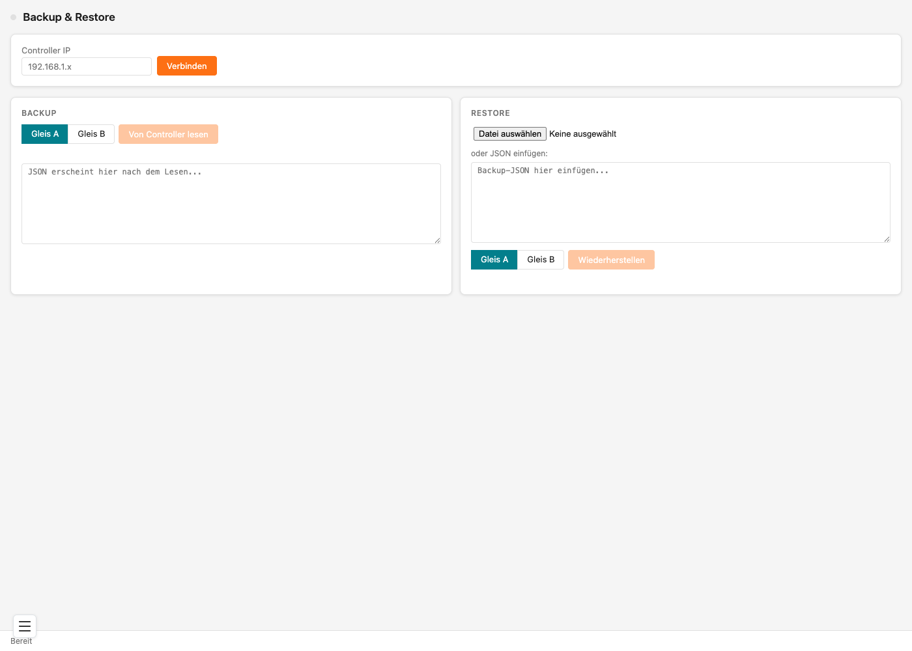

# Zugdaten sichern und wiederherstellen

Das Backuptool sichert die Zugliste eines Gleises in eine Datei auf deinem Computer und spielt sie bei Bedarf wieder ein.

## Inhalt
{: .no_toc .text-delta }

- TOC
{:toc}

---

## Was gesichert wird — und was nicht

Gesichert wird die **Zugliste** eines Gleises — also alle Züge mit Zeit, Zugnummer, Ziel, Via, Hinweis, Wagenreihung und DCC-Adresse.

**Nicht** gesichert werden:

- deine **Bilder**
- die **Einstellungen** des Gleises (Anzeigeart, Gleisnummer, Intervall-Zeit, MQTT und so weiter)
- die **WLAN-Zugangsdaten**

Die Einstellungen sind schnell wieder eingetragen — die Zugliste nicht. Deshalb sichert das Tool genau die. Wie du die übrigen Sachen von Hand sicherst, steht unter [Konfiguration und Bilder sichern](#konfiguration-und-bilder-sichern).

> **Wichtig:** Sichere deine Zugliste **bevor** du ein Update des Dateisystems einspielst. Ein solches Update überschreibt Zugdateien und Bilder.

---

## Das Backuptool öffnen

Klicke unten links auf das **Menü-Symbol** (drei Striche) und wähle **Züge Backuptool**.

> **Hinweis:** Obwohl die Seite vom Anzeiger selbst kommt, musst du seine **IP-Adresse** zuerst von Hand eintragen. Gib sie oben bei **Controller IP** ein und klicke auf **Verbinden**. Erst danach lassen sich die Knöpfe darunter benutzen.

---

## Eine Sicherung erstellen

1. Wähle im Bereich **BACKUP** aus, welches Gleis du sichern willst — **Gleis A** oder **Gleis B**
2. Klicke auf **Von Controller lesen**. Im großen Feld darunter erscheinen deine Zugdaten
3. Klicke auf **⇩ Als Datei speichern**

Die Datei landet im Download-Ordner deines Browsers.

> **Tipp:** Nimm einen Dateinamen, aus dem hervorgeht, zu welchem Gleis und welchem Stand die Sicherung gehört, zum Beispiel `bahnhof-nord-gleisA-2026-09.json`.

> **Hinweis:** Hast du zwei Gleise, brauchst du **zwei** Sicherungen — eine je Gleis.

---

## Eine Sicherung zurückspielen

1. Klicke im Bereich **RESTORE** auf **Datei auswählen** und wähle deine Sicherungsdatei
2. Wähle darunter das Gleis aus, auf das die Züge sollen
3. Klicke auf **Wiederherstellen**

Alternativ kannst du den Inhalt einer Sicherung auch direkt in das Textfeld einfügen, wenn du ihn zum Beispiel per Mail bekommen hast.

> **Wichtig:** Achte darauf, das richtige Gleis auszuwählen. Spielst du eine Sicherung von Gleis A auf Gleis B ein, landen die Züge dort.

---

## Alle Züge löschen

Im Bereich **BACKUP** gibt es den Knopf **Alle Züge löschen**. Der räumt die komplette Zugliste des gewählten Gleises ab — praktisch, wenn du von vorn anfangen willst.

> **Wichtig:** Erst sichern, dann löschen. Rückgängig machen lässt sich das nicht.

---

## Züge auf einen anderen Anzeiger übertragen

Hast du mehrere Zugzielanzeiger und willst dieselben Züge auf allen haben:

1. Sichere die Zugliste des ersten Anzeigers wie oben beschrieben
2. Öffne das Backuptool des zweiten Anzeigers — oder trage oben einfach dessen **IP-Adresse** ein und klicke auf **Verbinden**
3. Spiele die Datei dort ein

So kannst du auch einen Bahnsteig mit zwei Gleisen schnell gleich bestücken und danach nur noch die Abweichungen von Hand ändern.

---

## Konfiguration und Bilder sichern

In zwei Fällen ist alles weg, was nicht in der Zugsicherung steckt:

- Beim **Update des Dateisystems** über die Upgrade-Seite werden Zugdateien und Bilder überschrieben.
- Ist das Dateisystem nach einem Stromausfall beschädigt, **formatiert sich der Controller selbst** und startet sauber. Er läuft danach wieder, ist aber leer.

Beides passiert selten, aber es lohnt sich, vorbereitet zu sein.

### Die Einstellungen sichern

Ruf im Browser die Adresse deines Anzeigers auf, ergänzt um `/GleisA/config.json` — also zum Beispiel `192.168.178.41/GleisA/config.json`. Du siehst dann die Einstellungen dieses Gleises als Text. Speichere die Seite über das Menü deines Browsers als Datei ab. Hat dein Anzeiger zwei Gleise, machst du dasselbe noch einmal mit `/GleisB/config.json`.

> **Hinweis:** Diese Datei lässt sich nicht zurückspielen. Sie dient zum Nachschlagen — die Werte trägst du im Bedarfsfall von Hand wieder in das Konfigurationsfenster ein.

**Einfacher geht es so:** Öffne das Konfigurationsfenster mit dem Zahnrad **⚙** und mach ein Bildschirmfoto davon. Bei zwei Gleisen je eines. Das reicht für den Notfall völlig und du musst dich mit keiner Datei befassen.

### Die Bilder sichern

Schalte in der Kachel auf **Bilder** um. Klicke dann mit der rechten Maustaste auf ein Vorschaubild und wähle **Bild speichern unter** — die Vorschau ist die Originaldatei. Das wiederholst du für jedes Bild, das du behalten willst.

> **Tipp:** Am einfachsten ist es, die Bilder ohnehin dort aufzubewahren, wo du sie erstellt hast. Dann brauchst du sie gar nicht erst herunterzuladen.

---

## Problembehebung

| Problem | Lösung |
|---|---|
| Die Knöpfe sind ausgegraut | Trage oben die **Controller IP** ein und klicke auf **Verbinden** |
| **Von Controller lesen** bringt nichts | Prüfe, ob die IP-Adresse stimmt und der Anzeiger eingeschaltet ist |
| Nach dem Wiederherstellen fehlen Züge | Prüfe, ob das richtige Gleis ausgewählt war |
| Meine Bilder sind nach dem Wiederherstellen weg | Bilder sind nicht Teil der Sicherung. Lade sie neu hoch — siehe [Bilder statt Züge anzeigen](bilder-anzeigen.md) |
| Die Einstellungen stimmen nicht mehr | Auch die sind nicht Teil der Sicherung. Trage sie über das Zahnrad **⚙** neu ein |
| Nach einem Firmware-Update sind alle Züge weg | Das passiert beim Update des Dateisystems. Spiele deine Sicherung wieder ein |
