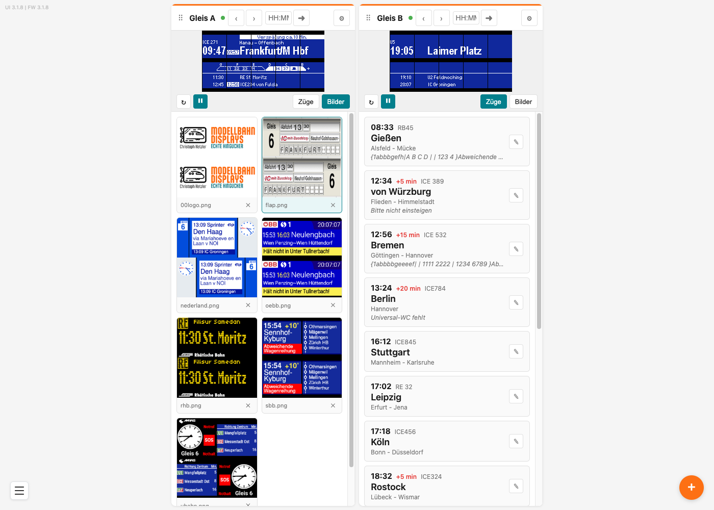
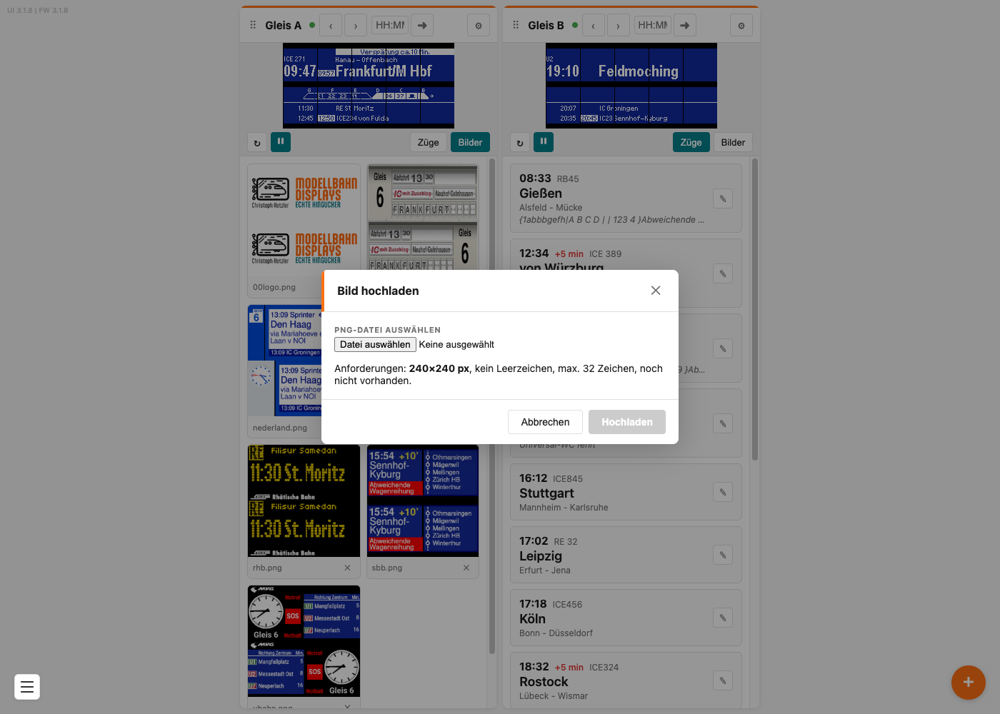
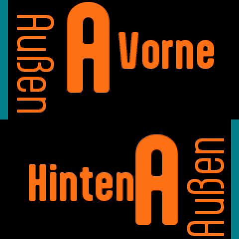
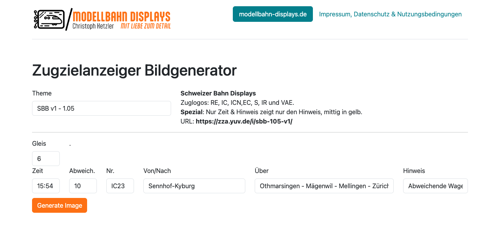
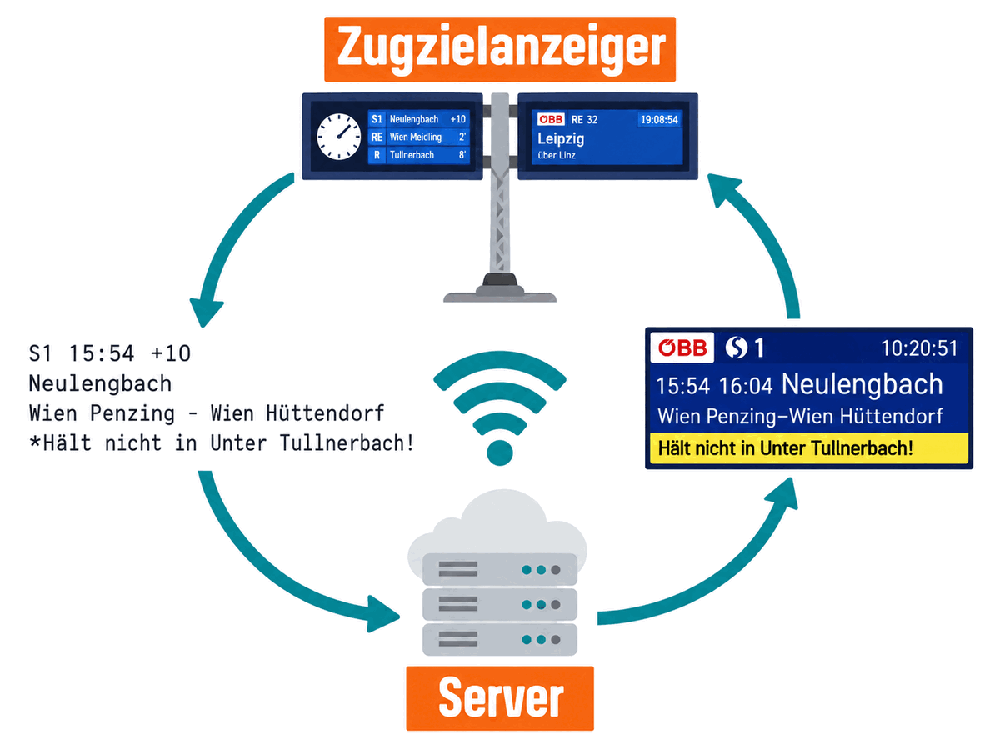

# Bilder statt Züge anzeigen

Neben der eingebauten Zugtafel kann der Zugzielanzeiger fertige Bilder anzeigen. Damit stellst du Anzeigen dar, die sich mit dem eingebauten Layout nicht nachbauen lassen — zum Beispiel im Stil der SBB, der ÖBB oder einer U-Bahn. Außerdem kann er Bilder von einer Web-Adresse holen, die sich von selbst aktualisieren.

## Inhalt
{: .no_toc .text-delta }

- TOC
{:toc}

---

## Auf Bilder umschalten

Öffne mit dem Zahnrad **⚙** die Einstellungen und wähle eine der beiden Bild-Anzeigearten:

- **Bilder Manuell** — zeigt ein Bild und wartet, bis du ein anderes auswählst
- **Bilder Intervall** — wechselt von selbst alle paar Sekunden zum nächsten Bild. Wie lange ein Bild stehen bleibt, stellst du bei **Intervall-Zeit (s)** ein

Nach dem **Speichern** zeigt das Display das erste Bild.

---

## Die Bilderliste

In der Kachel schaltest du über der Liste von **Züge** auf **Bilder** um. Darunter erscheinen alle Bilder, die auf diesem Gleis liegen.



- **Klick auf ein Bild** zeigt es sofort auf dem Display an. Das gerade gezeigte Bild ist farblich hervorgehoben
- **✕** löscht das Bild, nach einer Rückfrage
- Ganz unten steht **+ Bild hochladen**

Jedes Gleis hat seine **eigene** Bilderliste — ein Bild auf Gleis A erscheint nicht automatisch auch auf Gleis B.

> **Hinweis:** Im Auslieferungszustand liegen schon Beispielanzeigen auf dem Gerät — unter anderem im Stil der SBB, der ÖBB, der Rhätischen Bahn, der niederländischen Bahn und der Münchner U-Bahn, dazu eine Fallblattanzeige.

---

## Ein Bild hochladen

Klicke auf **+ Bild hochladen** und wähle eine PNG-Datei von deinem Computer oder Smartphone.



Die Oberfläche prüft die Datei sofort und zeigt dir Dateiname, Dateigröße, Breite, Höhe und den freien Speicher an — **grün**, wenn alles passt, **rot**, wenn etwas nicht stimmt. Der Knopf **Hochladen** bleibt ausgegraut, solange nicht alle Bedingungen erfüllt sind.

| Anforderung | Erklärung |
|---|---|
| **Format PNG** | Andere Formate wie JPG oder GIF werden nicht angenommen |
| **Genaue Bildgröße** | **240 × 240 Pixel**. Die Angabe steht auch im Hinweistext des Fensters |
| **Kein Leerzeichen im Dateinamen** | Benutze stattdessen Bindestriche oder Unterstriche |
| **Höchstens 32 Zeichen im Dateinamen** | Kürzere Namen sind übersichtlicher |
| **Name noch nicht vergeben** | Ein Bild mit demselben Namen musst du erst löschen |

Nach dem **Hochladen** dauert es einen kurzen Moment, dann erscheint das Bild in der Liste.

> **Tipp:** Pro Gleis passen bis zu 100 Bilder auf den Controller. Die Anzeige **Freier Speicher** im Upload-Fenster sagt dir, wie viel Platz noch übrig ist.

---

## Die Reihenfolge festlegen

In der Anzeigeart **Bilder Intervall** laufen die Bilder **in alphabetischer Reihenfolge** durch — nicht in der Reihenfolge, in der du sie hochgeladen hast.

Willst du die Reihenfolge selbst bestimmen, stell den Dateinamen Zahlen voran:

```
10-begruessung.png
20-werbung.png
30-abschied.png
```

So machen es auch die mitgelieferten Beispielbilder.

> **Hinweis:** Einen Dateinamen kannst du auf dem Controller nicht ändern. Benenne die Datei auf deinem Computer um und lade sie neu hoch.

---

## Wie das Bild auf Vorder- und Rückseite kommt

Die Anzeige eines Gleises ist doppelseitig und vom Bahnsteig aus von beiden Seiten lesbar. Bei der Zugtafel steht auf beiden Seiten dasselbe. Ein Bild dagegen wird auf **beide Seiten aufgeteilt**: Die eine Hälfte erscheint vorn, die andere hinten.

Deshalb ist die geforderte Bildhöhe doppelt so groß wie das, was eine Seite zeigt. So kannst du auf beiden Seiten **unterschiedliche Inhalte** zeigen — zum Beispiel die Gleisnummer jeweils zur Bahnsteigaußenseite hin.

Beide Hälften legst du **aufrecht** an. Drehen oder spiegeln musst du nichts, das übernimmt der Anzeiger.

Dabei gilt: Die **obere** Hälfte deines Bildes erscheint **vorne**, die **untere** Hälfte **hinten**.

{: style="max-width: 40%;" }

Soll auf beiden Seiten dasselbe stehen, setzt du denselben Inhalt einfach zweimal untereinander — so sind die mitgelieferten Beispielbilder `sbb.png` und `rhb.png` aufgebaut.

> **Tipp:** Entwirf dein Bild so, dass beide Hälften für sich funktionieren — jede Seite zeigt nur eine davon.

---

## Bilder aus dem Web

Unter [zza.yuv.de/i/](http://zza.yuv.de/i/) gibt es einen Generator, der Anzeigen im Stil anderer Bahnen zeichnet — ÖBB, SBB, Rhätische Bahn, U-Bahn München und weitere.

Es gibt **zwei Wege**, seine Anzeigen auf den Anzeiger zu bekommen. Sie unterscheiden sich in dem, was am Ende auf der Tafel steht — und sie brauchen **unterschiedliche Anzeigearten**:

| | Weg 1: Bild herunterladen | Weg 2: Image-URL |
|---|---|---|
| **Was auf der Tafel steht** | ein Standbild mit den Zügen, die du im Generator eingetippt hast | deine echten Züge vom Anzeiger, gezeichnet im Design des Generators |
| **Wann es sich ändert** | nie — bis du ein anderes Bild hochlädst | jede Minute, automatisch |
| **Nötige Anzeigeart** | **Bilder Manuell** oder **Bilder Intervall** | **Manuell**, **Intervall** oder **Live** |
| **Zugliste** | wird nicht benutzt | ist die Quelle der Anzeige |

Weg 1 ist der einfachere: Du erzeugst ein Bild, lädst es herunter und spielst es wie jedes andere Bild auf den Anzeiger. Weg 2 nimmt dir die Arbeit ab — du pflegst deine Züge ganz normal in der Zugliste, und das Aussehen kommt vom Generator.

---

## Weg 1: Ein Bild erzeugen und hochladen

Wähle oben unter **Theme** ein Design, trage **Gleis** ein und fülle bis zu drei Züge mit **Zeit**, **Abweich.**, **Nr.**, **Von/Nach**, **Über** und **Hinweis**. Ein Klick auf **Generate Image** erzeugt das Bild.



Rechts neben der Theme-Auswahl stehen die Besonderheiten des gewählten Designs — etwa welche Zuglogos es kennt — und darunter die **URL**, die du für Weg 2 brauchst.

So kommt das fertige Bild auf den Anzeiger:

1. Klicke mit der **rechten Maustaste** auf das erzeugte Bild und wähle **Bild speichern unter…** (am Smartphone: lange auf das Bild tippen, dann **Bild sichern**)
2. Lade die gespeicherte PNG-Datei wie jedes andere Bild hoch — siehe [Ein Bild hochladen](#ein-bild-hochladen)
3. Stell die Anzeigeart auf **Bilder Manuell** oder **Bilder Intervall**

Das Ergebnis ist ein Standbild: Es zeigt immer die Züge, die du im Formular eingetragen hast. Ändert sich etwas an deinem Fahrplan, erzeugst du ein neues Bild.

---

## Weg 2: Der Generator zeichnet deine echten Züge

Trägst du die Adresse des Generators in den Einstellungen bei **Image-URL** ein, schickt der Anzeiger **jede Minute seine eigenen Zugdaten** dorthin — die drei Züge, die sonst auf der Tafel stünden — und bekommt ein frisch gezeichnetes Bild zurück. Auf der Tafel stehen dann deine echten Züge, aber im Design einer anderen Bahn.

Du pflegst deine Züge also ganz normal in der Zugliste, und das Aussehen kommt vom Generator. In der Anzeigeart **Live** sind es sogar die echten Fahrplandaten.

> **Wichtig:** Dieser Weg läuft **nicht** in den Bild-Anzeigearten. Steht die Anzeigeart auf **Bilder Manuell** oder **Bilder Intervall**, fragt der Anzeiger die Adresse gar nicht erst ab — dort zeigt er nur Bilder, die auf ihm liegen. Für den Generator brauchst du **Manuell**, **Intervall** oder **Live**; nur dort hat der Anzeiger Zugdaten, die er verschicken kann.

So richtest du ihn ein:

1. Wähle auf der Generator-Seite ein **Theme** und kopiere rechts in der Infospalte die **URL**
2. Öffne am Anzeiger mit dem Zahnrad **⚙** die Einstellungen
3. Trage die Adresse bei **Image-URL** ein
4. Stell die Anzeigeart auf **Manuell**, **Intervall** oder **Live**
5. **Speichern**

> **Wichtig:** Die Generator-Seite zeigt die Adresse mit `https://` an. Der Anzeiger kann **nur unverschlüsselte** Adressen abrufen — trage sie deshalb mit `http://` ein, also ohne das `s`.

Löschst du den Inhalt des Feldes **Image-URL** wieder und speicherst, kommt die eingebaute Zugtafel zurück.



### Die Designs

Der Generator bietet dieselben Designs auch für ältere Displaygrößen an. Nimm die Adressen aus dieser Tabelle — sie passen zu den 1,05"-Anzeigern.

| Design | Adresse |
|---|---|
| ÖBB | `http://zza.yuv.de/i/oebb-105-v1/` |
| SBB | `http://zza.yuv.de/i/sbb-105-v1/` |
| Rhätische Bahn | `http://zza.yuv.de/i/rhb-105-v1/` |
| U-Bahn München | `http://zza.yuv.de/i/umuc-105-v1/` |
| Nederland | `http://zza.yuv.de/i/nederland-105-v1/` |
| Faltblatt | `http://zza.yuv.de/i/faltblatt-105-v1/` |

> **Tipp:** Eine Adresse kannst du vorher im Browser ausprobieren. Rufst du sie einfach auf, bekommst du ein Beispielbild zu sehen — dann weißt du, dass sie stimmt.

---

## Problembehebung

| Problem | Lösung |
|---|---|
| **Hochladen** bleibt ausgegraut | Eine der Anforderungen ist nicht erfüllt. Die rot markierte Zeile im Fenster sagt dir, welche |
| „Keine gültige PNG-Datei" | Die Datei ist kein PNG. Speichere sie in einem Bildprogramm als PNG |
| Das Bild ist zu groß oder zu klein | Die Abmessungen müssen exakt stimmen. Die geforderte Größe steht im Upload-Fenster |
| Das Bild erscheint nicht auf dem Display | Prüfe die Anzeigeart — sie muss auf **Bilder Manuell** oder **Bilder Intervall** stehen |
| Die Bilder laufen in falscher Reihenfolge | Sortiert wird alphabetisch. Stell den Dateinamen Zahlen voran |
| Nur die Hälfte meines Bildes ist zu sehen | Das ist so gewollt — die andere Hälfte steht auf der Rückseite |
| Das Bild von der **Image-URL** kommt nicht | Prüfe zuerst die Anzeigeart: In **Bilder Manuell** und **Bilder Intervall** wird die Adresse nicht abgefragt. Sie muss auf **Manuell**, **Intervall** oder **Live** stehen |
| Die **Image-URL** stimmt, es kommt trotzdem kein Bild | Prüfe, ob die Adresse mit `http://` beginnt und ob der Anzeiger ins Internet kommt |
| Der Generator zeigt andere Züge als meine Zugliste | Das Bild ist ein heruntergeladenes Standbild (Weg 1). Für die echten Züge brauchst du die **Image-URL** (Weg 2) |
| Ich will ein Bild umbenennen | Das geht auf dem Controller nicht. Umbenennen, neu hochladen, altes löschen |
