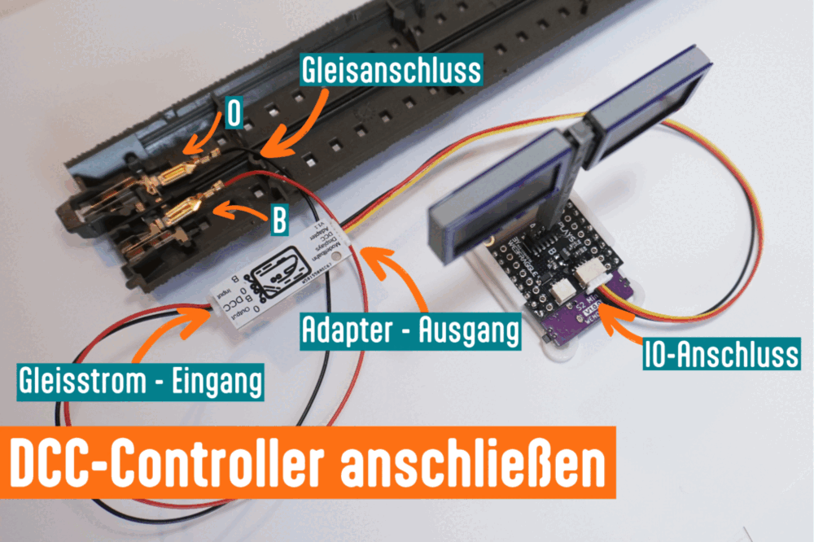
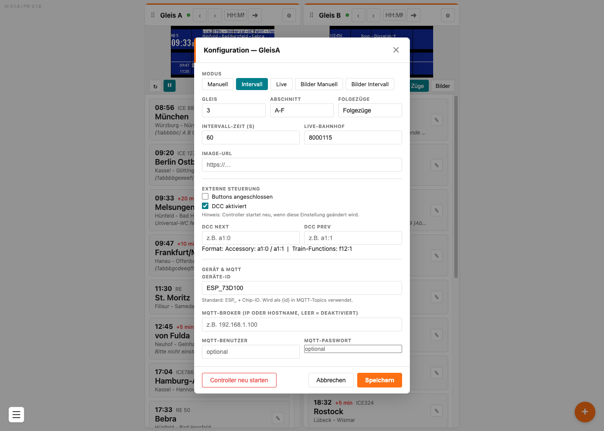

# Über die Modellbahnzentrale steuern (DCC)

Du kannst deinen Zugzielanzeiger direkt aus deiner Digitalzentrale bedienen — so wie eine Weiche oder ein Signal. Dann wechselt die Tafel zum Beispiel automatisch, wenn du auf der Anlage die Ausfahrt eines Zuges stellst.

## Inhalt
{: .no_toc .text-delta }

- TOC
{:toc}

---

## Was du brauchst

- Eine **Digitalzentrale** mit DCC (zum Beispiel von Roco, Märklin, ESU, Lenz, Uhlenbrock)
- Den als Zubehör erhältlichen **DCC-Adapter**, der den Gleisstrom für den Controller aufbereitet

---

## Den DCC-Adapter anschließen

Für **jeden Controller** brauchst du einen eigenen Adapter.

1. Schließe das Anschlusskabel an deinen **Gleisstrom** an. Beim C-Gleis kommt das **rote** Kabel an **B** und das **schwarze** an **0**
2. Steck das Kabel vom Gleis in die **Input-Buchse** des Adapters
3. Verbinde das dreiadrige Kabel mit dem vierpoligen Stecker vom **Ausgang des Adapters** mit dem **IO-Anschluss** des Zugzielanzeigers



> **Wichtig:** Der Adapter versorgt den Controller **nicht** mit Strom. Der braucht weiterhin sein USB-C-Kabel oder den Spannungswandler. Der Gleisstrom ist im Adapter bewusst von der Spannung des Controllers getrennt.

> **Tipp:** Am Ausgang des Adapters kannst du über ein 2-poliges SH1.0-Kabel weitere Adapter anschließen.


> **Wichtig:** Taster am Controller und DCC-Steuerung schließen sich gegenseitig aus — beide nutzen denselben Anschluss. Entscheide dich für eines von beidem.

---

## DCC einschalten

1. Öffne mit dem Zahnrad **⚙** die Einstellungen des Gleises
2. Kreuze unter **Externe Steuerung** das Feld **DCC aktiviert** an
3. **Speichern**

Der Controller **startet danach neu** — das dauert ein paar Sekunden, dann ist die Kachel wieder grün. Das ist nötig, weil der DCC-Eingang beim Start gesetzt wird.

> **Tipp:** Für die Bedienung per DCC eignet sich die Anzeigeart **Manuell** am besten. Dann schaltet nur, was du von der Zentrale aus auslöst.

Sobald **DCC aktiviert** angekreuzt ist, erscheinen zwei zusätzliche Felder: **DCC Next** und **DCC Prev**.



---

## Wie eine DCC-Adresse geschrieben wird

Der Anzeiger versteht zwei Arten von Befehlen. Beide schreibst du als kurzen Text in die Eingabefelder:

### Zubehöradressen — `a`

Das sind die Adressen, mit denen deine Zentrale Weichen und Signale schaltet.

```
a12:0
a12:1
```

`a` steht für Zubehör (englisch *accessory*), dann kommt die **Adresse**, ein Doppelpunkt und die **Stellung**.

Jede Zubehöradresse hat im DCC-Protokoll **zwei Schalter**. Welcher davon gemeint ist, steht nach dem Doppelpunkt:

| Wert | In der Zentrale |
|---|---|
| `0` | die **obere** Taste — bei der Märklin mobile station **rot** |
| `1` | die **untere** Taste — bei der Märklin mobile station **grün** |

`a2:0` heißt also: Magnetartikel 2, obere Taste. `a2:1` heißt: Magnetartikel 2, untere Taste.

> **Hinweis:** Du kannst dieselbe Taste beliebig oft drücken. Die Markierung im Display der Zentrale zeigt nur an, welche Taste zuletzt gedrückt wurde — für den Anzeiger spielt sie keine Rolle.

> **Tipp:** Mit `a12:0` und `a12:1` kannst du **dieselbe** Adresse für zwei verschiedene Aktionen nutzen — zum Beispiel vorwärts und rückwärts blättern.

### Lokfunktionen — `f`

Das sind die Funktionstasten einer Lokadresse, also F1, F2, F3 und so weiter.

```
f12:1
```

`f` steht für Funktion, dann die **Lokadresse**, ein Doppelpunkt und die **Funktionsnummer**.

 OFFEN-15 (2026-09-13, Autor): F0 auf Gleis A ist ein Versehen und soll
gefixt werden (DccFunctions.hpp:180 startet bei i=1 statt 0). Bis der Fix ausgeliefert
ist, beschreibt der Hinweis unten das tatsaechliche Verhalten von 3.1.8 — deshalb bleibt
er stehen. NACH DEM FIX: den Hinweis und die zugehoerige Zeile in der Problembehebung
ersatzlos streichen. 

> **Hinweis:** Nimm für Gleis A die Funktionen ab **F1**. Die Funktion F0 (Licht) wird dort nicht ausgewertet.

> **Wichtig:** Stell die Funktionstaste in deiner Zentrale von **Dauer** auf **Moment** um. Der Anzeiger reagiert immer auf den Wechsel von *aus* nach *ein*. Steht die Taste auf **Dauer** und die Funktion ist gerade eingeschaltet, musst du zweimal drücken — einmal zum Ausschalten, einmal zum erneuten Einschalten.

> **Tipp:** Eine bewährte Einrichtung ist eine **virtuelle Lok** in der Zentrale, die du zum Beispiel `Gleis 5` nennst. Jeder Funktionstaste dieser Lok weist du dann ein Zugziel zu.

---

## Vor- und Zurückblättern

In den Einstellungen des Gleises trägst du ein:

- **DCC Next** — diese Adresse schaltet zum nächsten Zug
- **DCC Prev** — diese Adresse schaltet zum vorigen Zug

Beispiel: Trägst du bei **DCC Next** `a1:0` und bei **DCC Prev** `a1:1` ein, blätterst du mit der Weichenadresse 1 durch deine Zugliste — einmal in jede Richtung.

> **Hinweis:** In den Bild-Anzeigearten blättern dieselben Befehle durch die **Bilderliste** statt durch die Zugliste. In der Anzeigeart **Live** haben sie keine Wirkung.

---

## Einen bestimmten Zug direkt aufrufen

Neben dem Blättern kannst du jedem einzelnen Zug seine **eigene** DCC-Adresse geben. Wird diese Adresse geschaltet, springt die Tafel direkt zu diesem Zug — ohne Blättern.

1. Öffne den Zug mit dem Stift **✎**
2. Trage im Feld **DCC** die Adresse ein, zum Beispiel `a20:0`
3. **Speichern**

So legst du für jeden Zug deines Fahrplans einen eigenen Knopf auf deiner Zentrale an. Das ist der übliche Weg, wenn ein Steuerungsprogramm die Anlage fährt — siehe [Anbindung an TrainController, iTrain und Rocrail](steuerungsprogramme.md).

> **Hinweis:** Trägst du etwas Ungültiges ein, meldet die Oberfläche **DCC-Format ungültig (Beispiel: a1:0 oder f12:1)**. Das Feld darf auch leer bleiben — dann ist dieser Zug eben nicht direkt aufrufbar.

---

## Was per DCC nicht geht

- Ein **bestimmtes Bild** direkt aufrufen — in den Bild-Anzeigearten kannst du nur blättern
- Die **Anzeigeart** umschalten
- Die **Uhrzeit** setzen

Dafür nutzt du die Weboberfläche oder [MQTT](mqtt.md).

---

## Problembehebung

| Problem | Lösung |
|---|---|
| Nichts passiert beim Schalten | Prüfe, ob **DCC aktiviert** angekreuzt und gespeichert ist und der Controller danach neu gestartet hat |
| Die Taster am Controller gehen nicht mehr | Das ist so. Bei aktivem DCC sind die Taster abgeschaltet — beide nutzen denselben Anschluss |
| Es wird zwei Schritte weitergeschaltet | Warte zwischen zwei Befehlen einen Moment. Befehle, die schneller als etwa eine fünftel Sekunde aufeinander folgen, werden zusammengefasst |
| Ich muss die Funktionstaste zweimal drücken | Die Taste steht auf **Dauer**. Stell sie in der Zentrale auf **Moment** um |
| Der Adapter ist angeschlossen, es passiert trotzdem nichts | Prüfe, ob der Controller zusätzlich über USB-C oder den Spannungswandler mit Strom versorgt ist. Der Adapter liefert keinen Strom |
| Eine Lokfunktion löst nichts aus | Prüfe die Funktionsnummer. Auf Gleis A wird F0 nicht ausgewertet — nimm F1 oder höher |
| Die Adresse in meiner Zentrale passt nicht zur eingetragenen | Manche Zentralen zählen Zubehöradressen anders. Probiere die Nachbaradresse aus |
| Ein Zug wird nicht direkt aufgerufen | Prüfe, ob im Zug selbst unter **DCC** eine Adresse steht — die Felder **DCC Next** und **DCC Prev** blättern nur |
| Nach dem Anhaken von **DCC aktiviert** ist der Anzeiger weg | Normal, der Controller startet neu |
