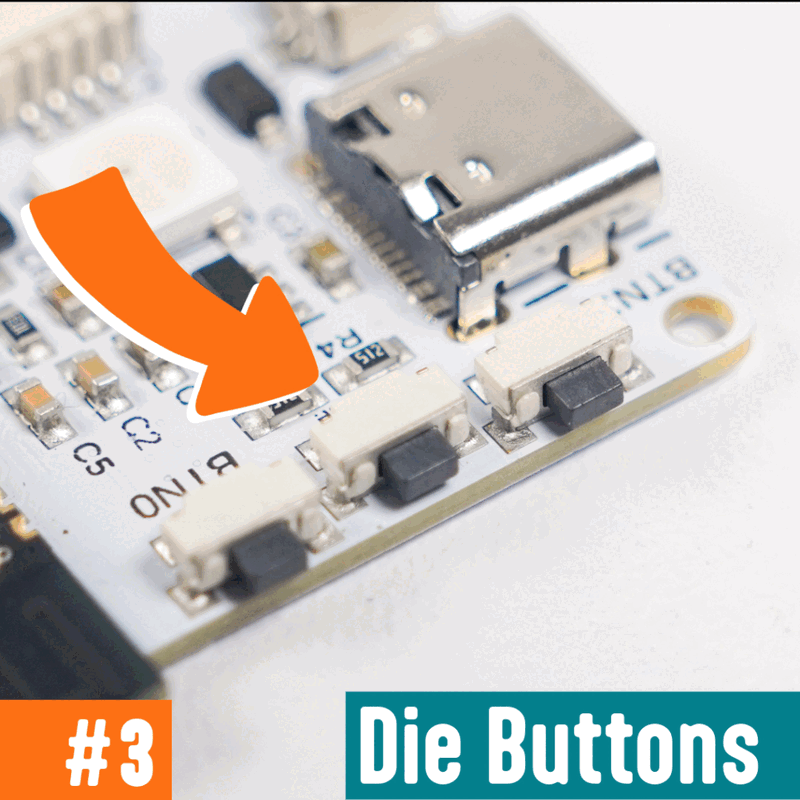
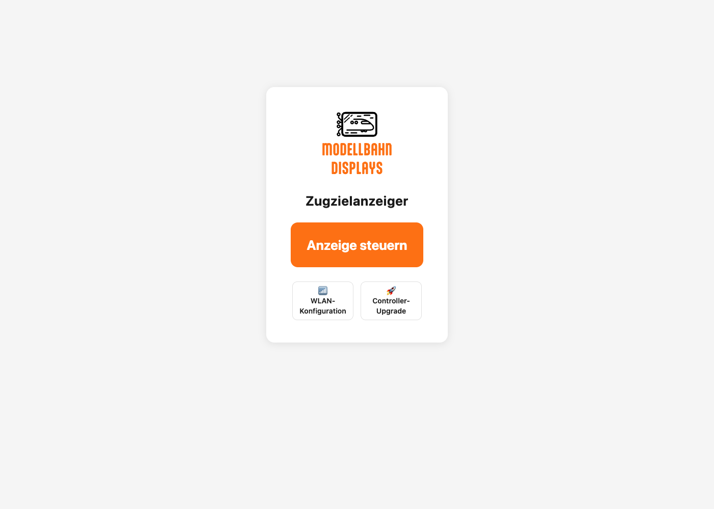
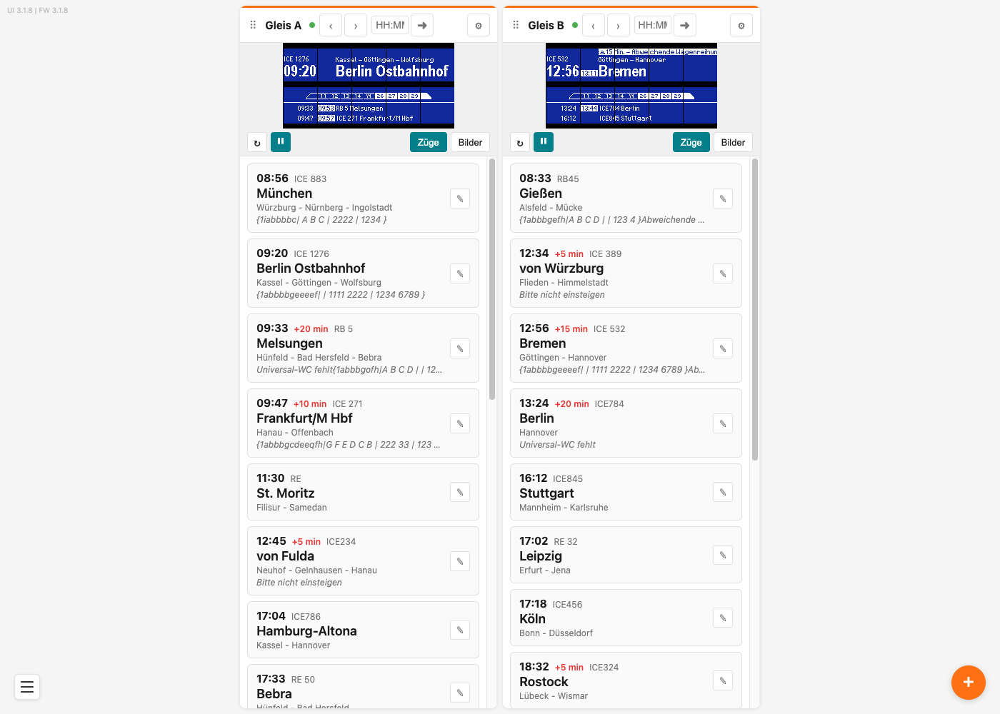
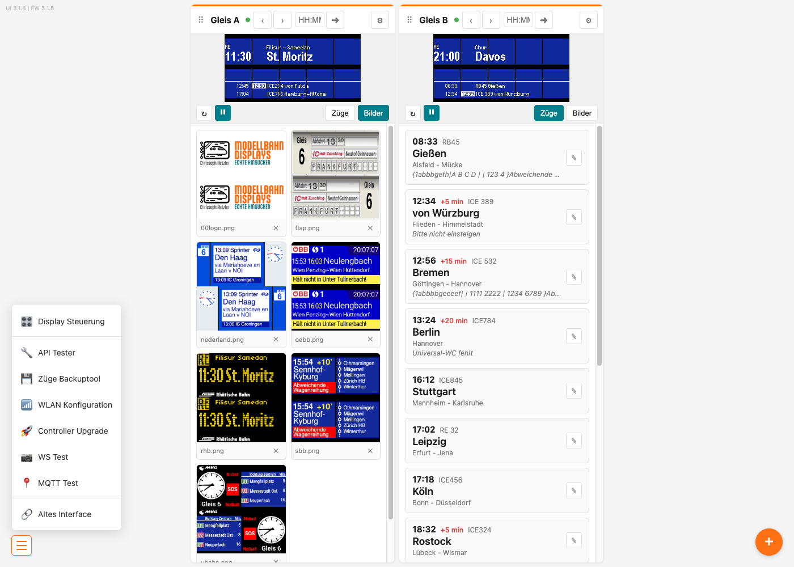

# Zugzielanzeiger in Betrieb nehmen

Diese Anleitung bringt deinen Zugzielanzeiger zum ersten Mal ans Laufen: anschließen, mit dem WLAN verbinden und die Weboberfläche öffnen, über die du später deine Züge einträgst.

## Inhalt
{: .no_toc .text-delta }

- TOC
{:toc}

---

## Anschließen und einschalten

Prüfe zuerst, dass die flachen Kabel (Flachbandkabel) zwischen Controller und Display richtig eingesteckt sind. Wie das geht, steht in der allgemeinen Anleitung [Flachbandkabel anschließen](../allgemein/flachbandkabel-anschliessen.md).

Verbinde den Controller anschließend über ein **USB-C-Kabel** mit einer Stromquelle — zum Beispiel einem USB-Netzteil vom Handy oder einer Powerbank. Nach ein paar Sekunden erscheint ein Startbild auf der Anzeige, und die kleine Leuchte (LED) am Controller leuchtet.

> **Tipp:** Willst du den Controller stattdessen über die Anlage versorgen — aus einem Modellbahn-Trafo, dem digitalen Gleisstrom oder einem Gleichstrom-Netzteil —, brauchst du den als Zubehör erhältlichen Spannungswandler. Er wird an den 2-Pin-Stromeingang des Controllers angeschlossen und nimmt **Gleichstrom von 8 bis 27 Volt** oder **Wechselstrom von 8 bis 19 Volt** an.

> **Wichtig:** Ältere Spannungswandler vertragen **nur Gleichstrom**. Wechselstrom nimmt erst der aktuelle an. Bist du dir nicht sicher, welchen du hast, bleib beim Gleichstrom.

> **Hinweis:** Zum Einrichten brauchst du ein Smartphone, Tablet oder einen Computer, der im selben WLAN ist.

An der Seite des Controllers sitzen drei Taster. Der mittlere ist der **Reset**-Taster; er liegt etwas nach innen versetzt, damit man ihn nicht versehentlich drückt. Den Taster **BTN 0** brauchst du gleich, um die Adresse des Anzeigers abzulesen.

{: style="max-width: 70%;" }

---

## Beim allerersten Start: Beleuchtung bestätigen

Die Displays gibt es mit zwei verschiedenen Schaltungen für die Hintergrundbeleuchtung, die genau entgegengesetzt angesteuert werden. Welche bei dir angeschlossen ist, findet der Controller beim **allerersten** Einschalten selbst heraus — dazu braucht er einmal deine Hilfe.

Auf dem Display steht dann **Jetzt BTN0 druecken**, und die Beleuchtung wechselt im Zwei-Sekunden-Takt zwischen hell und dunkel. Drücke die Taste **BTN 0** am Controller in dem Moment, in dem das Display **hell** ist.

Das Ergebnis wird dauerhaft gespeichert, die Abfrage kommt nicht wieder — auch nicht nach einem Firmware-Update.

> **Hinweis:** Startet dein Anzeiger gleich mit dem normalen Startbild, ist die Erkennung bereits erledigt — sie läuft nur ein einziges Mal.

### Danebengedrückt?

Hast du im falschen Moment gedrückt — also während das Display dunkel war — merkt sich der Controller die verkehrte Variante. Die Beleuchtung verhält sich dann genau umgekehrt: Das Display bleibt im Betrieb dunkel, obwohl der Anzeiger läuft.

Das lässt sich nachholen — allerdings nur über die **Reset**-Taste am Controller. Tippe sie nach dem Hochfahren zwei- bis dreimal kurz an, so wie unter [Über die Reset-Taste](../allgemein/wlan-einrichten.md#über-die-reset-taste) beschrieben. Dabei wird neben den WLAN-Daten auch die Beleuchtungs-Erkennung gelöscht. Beim nächsten Start erscheint **Jetzt BTN0 druecken** wieder, und du kannst es richtig bestätigen.

> **Wichtig:** Nur dieser Weg löscht die Erkennung. Änderst du die WLAN-Daten über das Webinterface, oder wechselt der Controller von selbst in den Konfigurationsmodus, weil er dein WLAN nicht findet, bleibt die falsch gespeicherte Beleuchtungsvariante erhalten.

> **Hinweis:** Mit der **Reset**-Taste gehen auch die WLAN-Zugangsdaten verloren — du musst das WLAN anschließend neu einrichten. Deine Züge, Bilder und Einstellungen bleiben erhalten.

---

## Mit dem WLAN verbinden

Damit du den Anzeiger bedienen kannst, verbindest du ihn mit deinem Heim-WLAN. Der Ablauf ist bei allen Displays gleich und in der allgemeinen Anleitung [WLAN einrichten](../allgemein/wlan-einrichten.md) Schritt für Schritt beschrieben. Dort steht auch, was die Farben der LED am Controller bedeuten.

---

## Die Adresse des Anzeigers herausfinden

Sobald der Anzeiger im WLAN ist, bekommt er eine **IP-Adresse** — eine Zahlenfolge wie `192.168.178.41`, eine Art Hausnummer in deinem Netzwerk. Die brauchst du, um die Weboberfläche zu öffnen.

Drücke dazu kurz die Taste **BTN 0** am Controller. Auf dem Display erscheint eine Info-Anzeige mit dem Logo, der Überschrift **IP-Adresse:** und darunter der Adresse. Unten rechts steht klein die Version der Betriebssoftware (Firmware), zum Beispiel `3.1.8`.

Ein zweiter Druck auf **BTN 0** schaltet die Info-Anzeige wieder aus, und die normale Zuganzeige kommt zurück.

 OFFEN-23: Die Info-Anzeige wird nur beim Einschalten gezeichnet und danach nicht aktualisiert (check_status() wird nie aufgerufen, main.cpp:180-192). Verbindet sich das Gerät, während die Anzeige sichtbar ist, steht dort weiter die alte Information. Als Einschränkung nennen oder vorher fixen? Der Satz unten ist die vorsichtige Formulierung. 

> **Tipp:** Ist der Anzeiger noch nicht mit dem WLAN verbunden, zeigt dieselbe Info-Anzeige stattdessen **WiFi Config:** mit dem Namen und dem Passwort des WLAN-Netzes, das der Controller selbst aufspannt. Damit richtest du das WLAN ein.

> **Hinweis:** Hat sich der Anzeiger gerade erst verbunden, während die Info-Anzeige schon zu sehen war, steht dort unter Umständen noch der alte Stand. Schalte sie dann mit **BTN 0** einmal aus und wieder ein.

---

## Die Weboberfläche öffnen

Gib die Adresse deines Anzeigers in die Adresszeile deines Browsers ein (zum Beispiel `192.168.178.41`) und drücke die Eingabetaste. Es öffnet sich die Startseite.

Von hier aus erreichst du alles Wichtige:

- **Anzeige steuern** — der große orange Knopf. Dahinter liegt die Seite, auf der du deine Züge einträgst und die Anzeige bedienst. Dort arbeitest du die meiste Zeit.
- **📶 WLAN-Konfiguration** — die WLAN-Zugangsdaten ändern, falls sich dein Netzwerk ändert.
- **🚀 Controller-Upgrade** — die Betriebssoftware des Controllers auf den neuesten Stand bringen.

> **Tipp:** Speichere die Adresse als Lesezeichen im Browser. Dann musst du sie nicht jedes Mal neu eintippen.

---

## Die Bedienoberfläche verstehen

Ein Klick auf **Anzeige steuern** öffnet die eigentliche Bedienoberfläche.

Jedes Gleis bekommt eine eigene **Kachel**. Den Zugzielanzeiger gibt es in zwei Ausführungen: für einen **Außenbahnsteig** mit einem Gleis — dann siehst du nur **Gleis A** — und für einen **Mittelbahnsteig** mit zwei Gleisen, wo **Gleis B** dazukommt. Die beiden Gleise sind völlig unabhängig voneinander, mit jeweils eigener Zugliste, eigenen Bildern und eigenen Einstellungen.

Oben links steht klein und grau, welche Software-Versionen im Einsatz sind, zum Beispiel `UI 3.1.8 | FW 3.1.8`.

### Der Kopf einer Kachel

Von links nach rechts:

| Element | Bedeutung |
|---|---|
| **⠿** | Anfasser zum Verschieben — damit ziehst du die Kacheln in die Reihenfolge, die dir passt |
| **Gleis A** | Der Name der Kachel. Klick darauf, und du kannst ihn direkt überschreiben, zum Beispiel in `Bahnhof Nord`. Enter speichert, Esc verwirft |
| **●** | Grün heißt: Der Anzeiger antwortet. Rot heißt: Er ist gerade nicht erreichbar |
| **‹** und **›** | Einen Zug zurück oder weiter |
| **HH:MM** und **➜** | Eine Uhrzeit eintippen und übernehmen — damit springt die Anzeige zum passenden Zug |
| **⚙** | Öffnet die Einstellungen dieser Anzeige |

### Das Live-Bild

Darunter siehst du ein Foto des tatsächlichen Displayinhalts, das sich **jede Sekunde** von selbst erneuert. Du kannst also vom Schreibtisch aus prüfen, was auf der Anlage zu sehen ist.

Mit **↻** lädst du das Bild einmalig neu, mit **⏸** hältst du die automatische Aktualisierung an (der Knopf wird dann zu **▶**).

### Züge oder Bilder

Rechts daneben schaltest du um, was die Kachel unten anzeigt:

- **Züge** — deine Zugliste. Damit arbeitest du normalerweise.
- **Bilder** — die Bilder, die auf diesem Gleis hinterlegt sind.

> **Wichtig:** Ein Klick auf eine Zugkarte schaltet die Anzeige **sofort** auf diesen Zug um — ohne Rückfrage. Zum Ändern eines Zuges nimmst du den Stift **✎** rechts auf der Karte. Das Gleiche gilt für die Bilder: Klick auf das Bild zeigt es an, das **✕** löscht es (mit Rückfrage).

---

## Das Menü

Unten links auf jeder Seite sitzt das **Menü-Symbol** (drei Striche). Ein Klick darauf öffnet das Menü.

Für den normalen Betrieb brauchst du davon vier Einträge:

- **Display Steuerung** — zurück zur Bedienoberfläche
- **Züge Backuptool** — deine Zugliste sichern und wiederherstellen, siehe [Zugdaten sichern](backup.md)
- **WLAN Konfiguration** — WLAN-Zugangsdaten ändern
- **Controller Upgrade** — neue Firmware einspielen

> **Hinweis:** Die Einträge **API Tester**, **WS Test**, **MQTT Test** und **Altes Interface** sind Werkzeuge zum Entwickeln und Prüfen.

---

## Wie es weitergeht

Ab Werk sind auf beiden Gleisen schon Beispielzüge hinterlegt, damit du sofort etwas siehst. Deine eigenen Züge trägst du unter [Züge anlegen und anzeigen](zuege-verwalten.md) ein.

Ob der Anzeiger einen Zug stehen lässt, automatisch weiterschaltet oder echte Fahrplandaten holt, stellst du unter [Anzeigeart und Einstellungen](anzeigearten.md) ein.

---

## Software aktualisieren

Von Zeit zu Zeit gibt es neue Funktionen oder Verbesserungen. Über **Controller Upgrade** bringst du die Betriebssoftware — die **Firmware** — deines Controllers auf den neuesten Stand. Der Ablauf ist bei allen Displays gleich und steht in der allgemeinen Anleitung [Controller aktualisieren (über WLAN)](../allgemein/controller-aktualisieren-wlan.md). Klappt das nicht, gibt es den Weg [per USB am Windows-PC](../allgemein/controller-aktualisieren-usb.md).

---

## Problembehebung

| Problem | Lösung |
|---|---|
| Die Anzeige bleibt komplett dunkel | Prüfe die Stromversorgung (USB-C-Kabel und Netzteil) und ob die Flachbandkabel fest sitzen |
| Auf dem Display steht **Jetzt BTN0 druecken** | Das ist die einmalige Erkennung der Beleuchtung. Drücke **BTN 0**, während das Display hell ist |
| Das Display bleibt dunkel, obwohl der Anzeiger läuft | Bei der Erkennung wurde im dunklen Moment gedrückt. Nur die **Reset**-Taste startet sie erneut — siehe [Danebengedrückt?](#danebengedrückt) |
| Ich finde die Adresse des Anzeigers nicht | Drücke kurz **BTN 0** am Controller — die Adresse erscheint auf dem Display |
| Die angezeigte Adresse stimmt nicht mehr | Schalte die Info-Anzeige mit **BTN 0** aus und wieder ein; sie aktualisiert sich nicht von selbst |
| Die Weboberfläche lädt nicht | Prüfe, ob dein Smartphone oder Computer im selben WLAN ist wie der Anzeiger, und tippe die Adresse ohne Tippfehler ein |
| Der Punkt in der Kachel ist rot | Der Anzeiger antwortet nicht. Prüfe Strom und WLAN-Verbindung — siehe [WLAN einrichten](../allgemein/wlan-einrichten.md) |
| Nur eine Kachel statt zwei | Dein Zugzielanzeiger ist die Ausführung für ein Gleis (Außenbahnsteig). Zwei Kacheln gibt es nur bei der Ausführung für zwei Gleise |
| Ich habe versehentlich einen anderen Zug angezeigt | Ein Klick auf die Zugkarte schaltet sofort um. Klicke einfach den gewünschten Zug wieder an |
