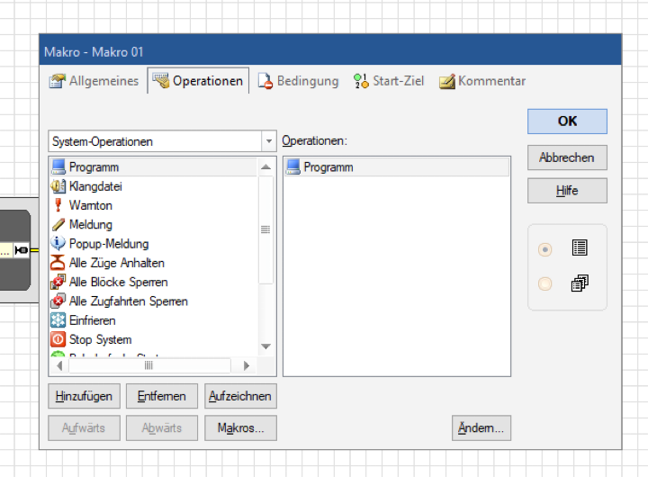
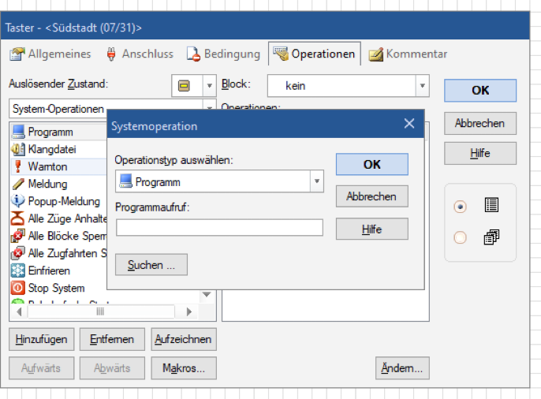
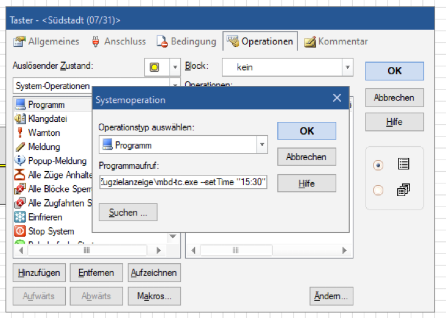

# Anbindung an TrainController, iTrain und Rocrail

Wird deine Anlage von einem Steuerungsprogramm gefahren, kann dieses die Zugzielanzeiger mitschalten — passend zur Zugfahrt, die gerade läuft.

## Inhalt
{: .no_toc .text-delta }

- TOC
{:toc}

---

## So funktioniert die Anbindung

Steuerungsprogramme wie TrainController™, iTrain oder Rocrail können an bestimmten Stellen deines Fahrplans **ein Programm auf deinem Rechner aufrufen**. Genau das nutzt die Anbindung: Ein kleines Hilfsprogramm namens **mbd-cli** nimmt den Befehl entgegen und schickt ihn über das WLAN an den Zugzielanzeiger.

Der Ablauf sieht so aus:

1. In deinem Steuerungsprogramm passiert etwas — ein Zug fährt ab, ein Signal geht auf Fahrt
2. Das Steuerungsprogramm ruft **mbd-cli** mit einem Befehl auf
3. **mbd-cli** schickt den Befehl an deinen Anzeiger und kehrt sofort zurück
4. Die Tafel wechselt

> **Wichtig:** Dein Rechner und der Zugzielanzeiger müssen im **selben Heim-WLAN** sein.

> **Tipp:** Willst du gar kein Zusatzprogramm, gibt es zwei Alternativen: Du steuerst den Anzeiger direkt aus der Digitalzentrale über [DCC](dcc-steuern.md), oder — wenn du ohnehin eine Hausautomation betreibst — über [MQTT](mqtt.md).

---

## Zwei Wege, die Tafel zu schalten

- **Über die Uhrzeit** — du übergibst eine Uhrzeit, und der Anzeiger holt den Zug, den du im Webinterface für diese Zeit eingetragen hast. Dein Fahrplan liegt dann im Anzeiger, das Steuerungsprogramm sagt nur, *wann* es soweit ist
- **Über die Zugdaten** — du übergibst Zugnummer, Zeit, Ziel und Via direkt aus dem Steuerungsprogramm. Dann steht der Fahrplan im Steuerungsprogramm, und der Anzeiger zeigt nur an

Der erste Weg ist einfacher und meistens die bessere Wahl.

---

## mbd-cli einrichten

Lade das Programm von der [Release-Seite auf GitHub](https://github.com/webfraggle/modellbahn-displays-traincontroller/releases) herunter und entpacke es in einen eigenen Ordner, zum Beispiel `Zugzielanzeige` auf dem Desktop. Für Windows ist das `mbd-cli.exe`, für macOS gibt es je eine Datei für Apple Silicon und für Intel.

**Starte das Programm einmal per Doppelklick, also ohne Befehl.** Dann öffnet sich eine Oberfläche, in der du alles Nötige einstellst:

- die **Endpoint-URL** — die Adresse deines Anzeigers, zum Beispiel `http://192.168.178.155`. Wie du sie herausfindest, steht unter [Zugzielanzeiger in Betrieb nehmen](inbetriebnahme.md#die-adresse-des-anzeigers-herausfinden)
- **Profile** für mehrere Anzeiger anlegen und löschen
- die **Verbindung testen**, bevor du im Steuerungsprogramm weiterarbeitest

Die Einstellungen landen als JSON-Dateien im Ordner `config/` neben dem Programm:

```json
{ "endpoint": "http://192.168.178.155" }
```

> **Tipp:** In der rechten Hälfte der Oberfläche sitzt ein **Befehlsgenerator**. Damit klickst du dir den passenden Befehl zusammen, probierst ihn direkt aus und kopierst ihn anschließend in dein Steuerungsprogramm. Das ist der bequemste Weg — du musst dir keinen der Befehle unten merken.

---

## Die Befehle

Alle Beispiele zeigen die Windows-Datei `mbd-cli.exe`. Unter macOS heißt sie `mbd-cli-arm64` beziehungsweise `mbd-cli-x64`.

### Weiterschalten

```
mbd-cli.exe --next
mbd-cli.exe --prev
```

### Zug über die Uhrzeit setzen

```
mbd-cli.exe --setTime "12:30"
```

Angezeigt wird der Zug, den du im Webinterface für diese Uhrzeit eingetragen hast.

### Zugdaten direkt setzen

Die Anzeige hat drei Zugslots — den großen Zug oben und die beiden Folgezüge darunter. Jeder Wert ist eine Kette aus sechs Angaben, getrennt durch einen senkrechten Strich:

```
Zugnummer|Zeit|Ziel|Via|Verspätung|Sonderinfo
```

```
mbd-cli.exe --setTrain1 "ICE123|12:30|Berlin|Hannover - Wolfsburg|0|"
mbd-cli.exe --setTrain1 "ICE123|12:30|Berlin|Hannover|0|Info" --setTrain2 "RE50|21:12|Bebra|Hünfeld|+10|"
```

Einen Slot leerst du, indem du nur die Trennstriche übergibst:

```
mbd-cli.exe --gleis B --setTrain1 "|||||"
```

Damit verschwindet der obere Zug, die Folgezüge bleiben stehen.

### Ein Bild anzeigen

```
mbd-cli.exe --image 00Logo.png
```

Zeigt ein Bild, das bereits auf dem Anzeiger liegt — siehe [Bilder statt Züge anzeigen](bilder-anzeigen.md). Es bleibt stehen, bis der nächste Zug oder das nächste Bild kommt.

### Das zweite Gleis ansprechen

```
mbd-cli.exe --gleis B --setTime "12:30"
```

Ohne diese Angabe geht der Befehl immer an **Gleis A**.

### Mehrere Anzeiger

Lege in der Oberfläche für jeden Anzeiger ein eigenes Profil an — zum Beispiel `gleis1` — und wähle es beim Aufruf aus:

```
mbd-cli.exe --conf gleis1 --setTime "12:30"
```

Ohne `--conf` wird `config/default.json` verwendet.

### Weitere Optionen

| Option | Bedeutung |
|---|---|
| `--timeout <ms>` | Wie lange auf den Anzeiger gewartet wird, in Millisekunden. Voreingestellt sind 30000 |
| `--conf <name>` | Lädt `config/<name>.json` statt `config/default.json` |

---

## In TrainController einrichten

In TrainController™ legst du den Aufruf als **System-Operation** an:

1. Menü **Operationen** öffnen
2. Untermenü **System-Operationen** wählen
3. Unten links auf **Hinzufügen** klicken und die System-Operation **Programm** auswählen
4. Über **Suchen** und **Ändern** den Pfad zu `mbd-cli.exe` auswählen
5. Dahinter den Befehl eintragen, zum Beispiel `--setTime "12:30"`

Die System-Operation **Programm** steht in der Liste links. Mit **Hinzufügen** wandert sie nach rechts zu den Operationen:



Im Fenster **Systemoperation** ist **Programm** als Operationstyp gewählt. Über **Suchen …** wählst du die Datei auf deiner Festplatte aus:



Dahinter, in dasselbe Feld **Programmaufruf**, kommt der Befehl:



> **Hinweis:** Die Screenshots stammen von 2023, deshalb steht im Programmaufruf noch der alte Dateiname `mbd-tc.exe`. Heute heißt die Datei `mbd-cli.exe`. An den Fenstern in TrainController hat sich nichts geändert.

Diese Operation weist du dann einem Taster oder Auslöser in deinem Fahrplan zu. Als auslösender Zustand wird üblicherweise **Ein** verwendet.

> **Wichtig:** Achte darauf, dass alle **Leerzeichen** und **Anführungszeichen** im Befehl stimmen. Das ist die häufigste Fehlerquelle.

> **Tipp:** Demselben Taster kannst du im Zustand **Aus** einen zweiten Befehl geben — zum Beispiel `--setTrain1 "|||||"`, um die obere Zeile wieder zu leeren.

---

## iTrain und Rocrail

Beide Programme können ebenfalls externe Programme mit Parametern aufrufen — der Ablauf ist derselbe, nur die Menüs heißen anders:

- **iTrain** — in der Programmanleitung unter **Aktionen**, dort gibt es den Punkt zum Ausführen von Programmen über die **Befehlszeile**
- **Rocrail** — ebenfalls über den Aufruf eines externen Programms mit Übergabe der Parameter

> **Hinweis:** Der Schwerpunkt liegt bei TrainController. Für iTrain und Rocrail liegen Rückmeldungen von Nutzern vor, dass es funktioniert — eine eigene bebilderte Anleitung gibt es dafür bisher nicht.

---

## Ausführliche Anleitung von Andri Müller

Andri Müller hat aufgeschrieben, wie er seine Anzeiger in **TrainController** und in **iTrain** eingebunden hat — mit Variablen, Makros und Bahnwärtern auf der einen, mit Aktionen und Bedingungen auf der anderen Seite. Dazu gehört auch, wie die Tafel automatisch wieder leer wird, sobald der Zug den Block verlässt.

[ZZA in TC und iTrain korrekt verknüpfen (PDF, Juni 2025)](https://www.modellbahn-displays.de/wp-content/uploads/2025/07/ZZA-in-TC-und-iTrain-korrekt-verknuepfen.pdf)

> **Wichtig:** Die Anleitung stammt von Juni 2025 und nennt das Hilfsprogramm noch bei seinen alten Namen. Ersetze in allen Befehlen `mbd-tc.exe` und `mbd-tc-hidden.exe` durch **`mbd-cli.exe`**. Die Variante mit dem Zusatz `-hidden` gibt es nicht mehr — sie war nur nötig, damit kein Fenster aufging und das Steuerungsprogramm nicht wartete. Beides erledigt mbd-cli seit Version 2.0.0 von selbst.

Die Befehle in der Anleitung — `--gleis`, `--setTime`, `--setTrain1` — sind unverändert gültig. Am Aufbau der Makros, Bahnwärter und Aktionen ändert sich nichts.

---

## macOS: Warnung beim ersten Start

Lädst du das Programm unter macOS herunter, blockiert das System die Ausführung mit der Meldung, die Datei könne nicht überprüft werden. Das liegt an einer Markierung, die macOS beim Herunterladen setzt.

Klicke im Finder mit der rechten Maustaste auf die Datei, wähle **Öffnen** und dann **Trotzdem öffnen**. Danach startet sie auch per Doppelklick.

---

## Problembehebung

| Problem | Lösung |
|---|---|
| Der Anzeiger reagiert nicht | Öffne **mbd-cli** ohne Befehl und teste die Verbindung in der Oberfläche |
| Die Adresse stimmt nicht mehr | Der Router hat dem Anzeiger eine neue vergeben. Trage die neue Adresse im Profil ein — oder vergib im Router eine feste Adresse |
| Es passiert nichts, es kommt aber auch keine Fehlermeldung | Neben dem Programm liegt eine Datei `debug.log`. Dort stehen alle Aufrufe und Fehler |
| Es wird der falsche Zug angezeigt | Beim Weg über die Uhrzeit zählt, was im Webinterface für diese Zeit eingetragen ist. Prüfe die Zeiten in deiner Zugliste |
| Ich habe mehrere Anzeiger und es reagiert immer derselbe | Lege je Anzeiger ein Profil an und gib es beim Aufruf mit `--conf` an |
| Umlaute werden falsch dargestellt | Ab Version 2.0.0 repariert **mbd-cli** doppelt kodierte Umlaute aus TrainController selbst. Prüfe, ob du die aktuelle Version verwendest |
| TrainController hängt kurz beim Aufruf | Ab Version 2.0.0 kehrt **mbd-cli** sofort zurück. Ältere Versionen blockierten. Aktualisiere das Programm |
