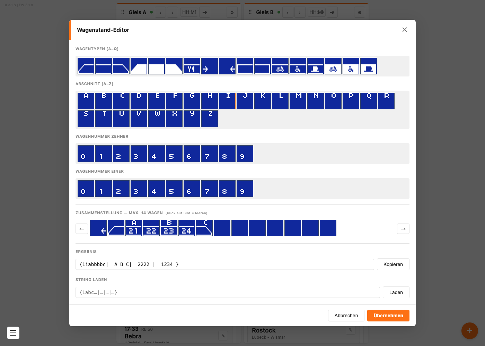
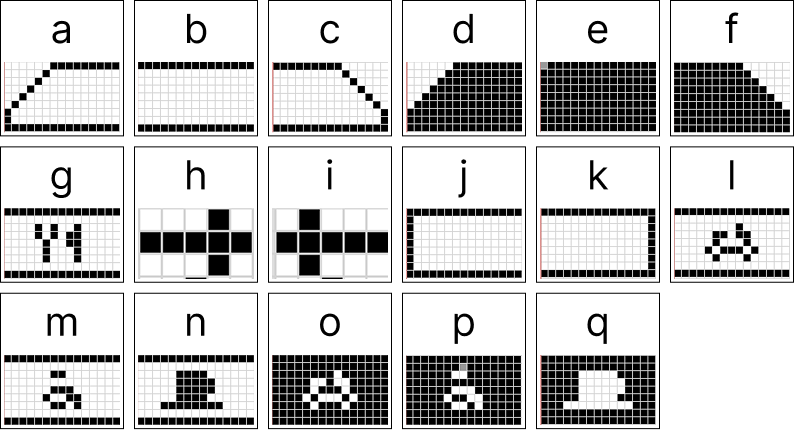

# Wagenreihung darstellen

Der Zugzielanzeiger kann unter dem Zielbahnhof eine Wagenreihung darstellen.

Gespeichert wird sie als codierter Text am Ende des Feldes **Hinweis** — eine Folge aus Buchstaben, Ziffern und Trennzeichen in geschweiften Klammern, zum Beispiel `{1abc|ABC|  1|123}`. Diesen Text musst du nicht selbst schreiben: Im **Wagenstand-Editor** der Weboberfläche stellst du den Zug mit der Maus zusammen, und der Editor trägt den fertigen Text in den Hinweis ein.

## Inhalt
{: .no_toc .text-delta }

- TOC
{:toc}

---

## Die vier Ebenen

Jeder Wagen besteht in der Darstellung aus bis zu vier Ebenen, die übereinander gezeichnet werden:

1. **Wagentyp** — das Symbol
2. **Abschnitt** — der Buchstabe des Bahnsteigabschnitts
3. **Wagennummer Zehner**
4. **Wagennummer Einer**

Im Editor hat jede dieser Ebenen ihre eigene Palette. Keine davon ist Pflicht.

---

## Den Wagenstand-Editor öffnen

Öffne einen Zug mit dem Stift **✎**. Rechts neben dem Feld **Hinweis** sitzt ein kleiner Knopf **☰** mit dem Tooltip *Wagenstand-Editor öffnen*. Ein Klick darauf öffnet den Editor.



> **Wichtig:** Den Editor gibt es nur beim **Bearbeiten** eines Zuges, nicht beim Hinzufügen. Lege einen neuen Zug also zuerst an, speichere ihn, und öffne ihn danach noch einmal mit dem Stift.

---

## Einen Zug zusammenstellen

Der Editor hat vier Paletten übereinander und darunter die Zusammenstellung mit **14 Ablagefeldern** — so viele Wagen passen maximal auf die Tafel.

1. **Wagentypen (a–q)** — zieh das passende Symbol per Maus auf ein Ablagefeld
2. **Abschnitt (A–Z)** — zieh den Buchstaben des Bahnsteigabschnitts auf dasselbe Feld
3. **Wagennummer Zehner** — die erste Ziffer der Wagennummer
4. **Wagennummer Einer** — die zweite Ziffer

Ein Wagen kann alle vier Angaben haben, muss aber nicht. Ein Symbol ohne Nummer ist genauso erlaubt wie eine Nummer ohne Abschnittsbuchstabe.

**Ein Feld leeren:** Klicke das Ablagefeld an — alle vier Ebenen dieses Feldes werden gelöscht.

**Den ganzen Zug verschieben:** Mit **←** und **→** links und rechts der Ablagefelder rückst du die komplette Zusammenstellung um eine Position. Praktisch, wenn dein Zug am Bahnsteig weiter vorn oder hinten halten soll.

Unter **Ergebnis** siehst du laufend mit, was dabei herauskommt. Mit **Kopieren** legst du diesen Text in die Zwischenablage.

> **Hinweis:** Je nach Browser bleibt der Knopf **Kopieren** ohne Wirkung. Markiere den Text im Feld **Ergebnis** dann mit der Maus und kopiere ihn mit **Strg + C** (am Mac **Cmd + C**).

Zum Schluss klickst du auf **Übernehmen**. Der Editor schließt sich, und die Wagenreihung steht im Feld **Hinweis**. Danach noch auf **Speichern** im Zug-Fenster — fertig.

> **Tipp:** Dein Hinweistext geht dabei nicht verloren. **Übernehmen** ersetzt nur eine eventuell vorhandene alte Wagenreihung und lässt den normalen Text stehen.

---

## Die Symbole

Die Palette enthält 17 Wagentypen, `a` bis `q`:



Manche Symbole kommen doppelt vor — einmal als Umriss und einmal ausgefüllt. Der Unterschied ist die Wagenklasse: **ausgefüllte Wagen gehören zur 1. Klasse**, Wagen im Umriss zur 2. Klasse. Genauso macht es die Deutsche Bahn auf ihren Wagenstandsanzeigern.


OFFEN-01 ist damit beantwortet (Autor, 2026-09-13): Bild 1:1 von der Website übernommen
(Quelle: modellbahn-displays.de/wp-content/uploads/2025/09/Wagenstandanzeige.png),
Buchstaben brauchen keine Beschreibung im Text, Umriss gegen gefüllt = nur der
Klassenunterschied.


OFFEN-26 (neu, Firmware): Die Wagennummern werden nur bei d, e, f invers gezeichnet
(DisplayV5x2.cpp:150-157). o, p und q sind genauso ausgefüllt, bekommen die Inversion
aber nicht — dort dürfte die Nummer auf der weißen Fläche unsichtbar sein.
Sieht nach einem Fehler aus, betrifft die Firmware und nicht die Anleitung.


---

## Eine bestehende Reihung weiterverwenden

Hast du eine Wagenreihung, die dir gefällt, kannst du sie auf andere Züge übertragen:

1. Öffne den Zug, dessen Reihung du übernehmen willst, und den Wagenstand-Editor
2. Klicke unter **Ergebnis** auf **Kopieren** — oder markiere den Text im Feld und kopiere ihn mit **Strg + C** (am Mac **Cmd + C**)
3. Öffne den anderen Zug und dessen Wagenstand-Editor
4. Füge den Text unten bei **String laden** ein — mit **Strg + V** (am Mac **Cmd + V**) — und klicke auf **Laden**
5. **Übernehmen**, dann **Speichern**

> **Hinweis:** Passt der eingefügte Text nicht ins erwartete Muster, blinkt das Eingabefeld kurz rot auf und es passiert nichts weiter. Prüfe dann, ob du den kompletten Text von `{` bis `}` erwischt hast.

---

## Wie die Reihung im Hinweis gespeichert wird

Du brauchst das nicht zu wissen, um den Editor zu benutzen — aber es erklärt den seltsamen Text, der nach dem Übernehmen im Feld **Hinweis** steht:

```
Heute ohne Halt in Ulm{1abc|ABC|  1|123}
```

Vor der geschweiften Klammer steht dein normaler Hinweistext, der über die Tafel läuft. In der Klammer steckt die Wagenreihung, aufgeteilt in die vier Ebenen, die durch `|` getrennt sind: Wagentypen, Abschnitte, Zehnerstellen, Einerstellen. Ein Leerzeichen bedeutet „an dieser Stelle nichts".

> **Hinweis:** Jede Ebene wird für sich von links nach rechts gezählt. Ein Leerzeichen hält den Platz frei — lässt du es weg, rutscht alles Nachfolgende dieser Ebene um eine Stelle nach vorn und steht über dem falschen Wagen. Am Ende einer Ebene darfst du Leerzeichen dagegen weglassen; die vier Ebenen müssen **nicht** gleich lang sein.

Die `1` direkt hinter der Klammer gehört dazu und darf nicht verändert werden.

> **Tipp:** Du kannst diesen Text auch von Hand eintippen oder aus einer anderen Quelle einfügen. Bequemer ist aber der Editor.

---

## Wo die Wagenreihung nicht erscheint

> **Wichtig:** Im Betrieb mit echten Fahrplandaten (Anzeigeart **Live**) wird **keine** Wagenreihung angezeigt. Die Fahrplanquelle liefert diese Angabe nicht mit. Die Wagenreihung funktioniert also nur bei Zügen, die du selbst angelegt hast.

---

## Problembehebung

| Problem | Lösung |
|---|---|
| Neben **Hinweis** gibt es keinen **☰**-Knopf | Du bist im Fenster *Zug hinzufügen*. Speichere den Zug zuerst und öffne ihn dann mit dem Stift **✎** |
| Die Wagenreihung erscheint nicht auf dem Display | Prüfe, ob die Anzeigeart auf **Live** steht — dort gibt es keine Wagenreihung |
| Der Hinweistext ist nach dem Übernehmen verschwunden | **Übernehmen** lässt den normalen Text stehen. Prüfe im Feld **Hinweis**, ob der Text vor der `{`-Klammer noch da ist |
| **Kopieren** legt nichts in die Zwischenablage | Markiere den Text im Feld **Ergebnis** mit der Maus und kopiere ihn mit **Strg + C** (am Mac **Cmd + C**) |
| **Laden** tut nichts, das Feld blinkt rot | Der eingefügte Text passt nicht ins Muster. Er muss mit `{1` beginnen und mit `}` enden |
| Ich brauche mehr als 14 Wagen | Mehr passen nicht auf die Tafel |
| Der Zug steht auf der Tafel zu weit links oder rechts | Verschiebe ihn mit **←** und **→** im Editor |
