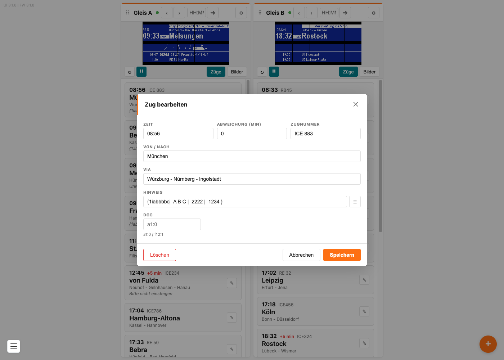
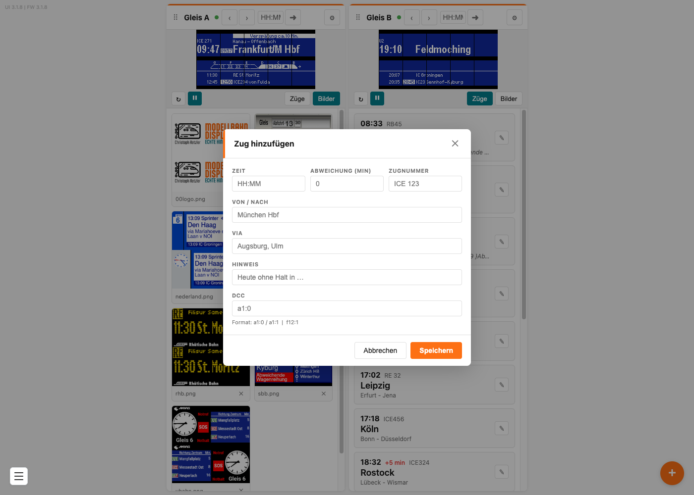

# Züge anlegen und anzeigen

In der Zugliste stehen die Züge, die an deinem Bahnsteig abfahren — mit Uhrzeit, Zugnummer, Ziel, Zwischenhalten und Verspätung. Jedes Gleis hat seine eigene Liste.

## Inhalt
{: .no_toc .text-delta }

- TOC
{:toc}

---

## Die Zugliste

Unter dem Live-Bild jeder Kachel steht die Zugliste — vorausgesetzt, der Umschalter steht auf **Züge** und nicht auf **Bilder**.

Jede Karte zeigt dir auf einen Blick: die Abfahrtszeit, bei Verspätung rot ein **+5 min**, die Zugnummer, groß das Ziel, darunter die Zwischenhalte und kursiv den Hinweistext.

Die Liste ist **nach der Abfahrtszeit sortiert**, nicht nach der Reihenfolge, in der du die Züge eingetragen hast. Trägst du einen Zug um 08:15 nach, rutscht er automatisch an die richtige Stelle.

> **Hinweis:** Pro Gleis kannst du bis zu **100 Züge** anlegen.

---

## Einen Zug ändern

Klicke auf den Stift **✎** rechts auf der Zugkarte. Es öffnet sich das Fenster **Zug bearbeiten**.

| Feld | Was du einträgst | Beispiel |
|---|---|---|
| **Zeit** | Die planmäßige Abfahrtszeit im Format `HH:MM`. Bestimmt auch die Position in der Liste | `14:32` |
| **Abweichung (min)** | Die Verspätung in Minuten. `0` heißt pünktlich | `5` |
| **Zugnummer** | Zuggattung und Nummer, wie sie auf der Tafel steht | `ICE 123` |
| **Von / Nach** | Der Zielbahnhof. Das ist die große Zeile auf dem Display | `München Hbf` |
| **Via** | Die Zwischenhalte, klein über dem Ziel. Mehrere Halte mit Bindestrich trennen | `Augsburg - Ulm` |
| **Hinweis** | Ein Text, der oben über die Tafel läuft. Darin steckt auch die Wagenreihung | `Heute ohne Halt in Ulm` |
| **DCC** | Die Adresse, mit der deine Modellbahnzentrale genau diesen Zug aufruft. Kann leer bleiben | `a1:0` |

 OFFEN-27 (UI, klein): Der Platzhalter im Feld *Via* lautet in control2.htm
„Augsburg, Ulm" — also mit Komma. Die Livedaten und die Konvention verwenden aber den
Bindestrich („Würzburg - Nürnberg - Ingolstadt"). Der Platzhalter führt damit in die Irre
und sollte in der Oberfläche angepasst werden. Im Screenshot zug-hinzufuegen.png ist die
alte Fassung noch zu sehen. 

Zum Schluss auf **Speichern**. Die Anzeige aktualisiert sich sofort.

> **Tipp:** Trägst du bei **Abweichung** eine Zahl größer als 0 ein, erscheint auf dem Display neben der planmäßigen Zeit zusätzlich die **neue Abfahrtszeit** auf weißem Grund. Die Laufschrift oben ergänzt automatisch **Verspätung ca. 5 Min.** vor deinem Hinweistext.

> **Hinweis:** Das Feld **DCC** brauchst du nur, wenn du den Anzeiger über deine Modellbahnzentrale bedienen willst. Wie die Adressen aufgebaut sind, steht unter [Über die Modellbahnzentrale steuern](dcc-steuern.md). Trägst du etwas Ungültiges ein, meldet die Oberfläche **DCC-Format ungültig (Beispiel: a1:0 oder f12:1)**.

---

## Einen Zug hinzufügen

Ganz unten in der Zugliste steht **+ Zug hinzufügen**. Das Fenster sieht genauso aus wie beim Bearbeiten, nur ohne den Knopf zum Löschen.

Fülle aus, was du brauchst — leer lassen ist erlaubt, zum Beispiel wenn ein Zug keine Zwischenhalte hat — und klicke auf **Speichern**.

> **Hinweis:** Beim **Hinzufügen** gibt es den Wagenstand-Editor noch nicht. Willst du eine Wagenreihung eintragen, speicherst du den Zug zuerst und öffnest ihn danach noch einmal mit dem Stift **✎**. Warum das so ist, steht unter [Wagenreihung darstellen](wagenreihung.md).

---

## Einen Zug löschen

Öffne den Zug mit dem Stift **✎**. Unten links im Fenster steht der rote Knopf **Löschen**. Die Rückfrage **Zug wirklich löschen?** bestätigst du — danach ist der Zug weg.

> **Tipp:** Bevor du größer aufräumst, lohnt sich eine Sicherung deiner Zugliste. Wie das geht, steht unter [Zugdaten sichern und wiederherstellen](backup.md).

---

## Zwischen den Zügen umschalten

Es gibt mehrere Wege, einen anderen Zug auf die Tafel zu holen:

- **Klick auf die Zugkarte** — schaltet sofort auf diesen Zug um, ohne Rückfrage
- **‹ und ›** im Kachelkopf — einen Zug zurück oder weiter
- **Uhrzeit eintippen und ➜** — springt zu dem Zug, der zu dieser Uhrzeit passt
- **Taster am Controller**, **Modellbahnzentrale per DCC** oder **MQTT** — siehe die jeweiligen Seiten

Ob der Anzeiger von selbst weiterschaltet oder auf einem Zug stehen bleibt, hängt von der eingestellten Anzeigeart ab — siehe [Anzeigeart und Einstellungen](anzeigearten.md).

---

## Was auf dem Display erscheint

Der Anzeiger zeigt nicht nur den ausgewählten Zug, sondern darunter auch die **beiden nächsten** Züge deiner Liste.

Von oben nach unten:

| Bereich | Inhalt |
|---|---|
| Laufschrift oben | Verspätungsangabe und dein Hinweistext. Passt der Text in die Zeile, steht er still; ist er länger, läuft er durch |
| links oben | Zugnummer |
| links groß | Planmäßige Abfahrtszeit |
| links, weißer Kasten | Die neue Abfahrtszeit — nur wenn eine Verspätung eingetragen ist |
| rechts oben, klein | Zwischenhalte (Via) |
| Mitte, groß | Das Ziel |
| Mitte | Die Wagenreihung, falls eingetragen |
| unten | Die beiden nächsten Züge mit Zeit, Nummer und Ziel |

Ist der ausgewählte Zug der letzte in der Liste, werden unten wieder die Züge vom Anfang gezeigt.

---

## Problembehebung

| Problem | Lösung |
|---|---|
| Ein neuer Zug taucht nicht an der erwarteten Stelle auf | Die Liste sortiert nach der **Zeit**, nicht nach der Eingabereihenfolge |
| Der Hinweistext läuft nicht durch | Kurze Texte stehen still. Erst längere Texte laufen von selbst durch |
| Im Hinweis steht seltsamer Code wie `{1abbbc\|…}` | Das ist die Wagenreihung. Sie wird auf dem Display als Bild dargestellt — siehe [Wagenreihung darstellen](wagenreihung.md) |
| Die neue Abfahrtszeit erscheint nicht | Sie wird nur angezeigt, wenn bei **Abweichung (min)** eine Zahl größer als 0 steht |
| Änderungen sind nach dem Speichern nicht zu sehen | Prüfe, ob die Anzeige gerade einen anderen Zug zeigt. Klicke die Zugkarte an, um auf den geänderten Zug umzuschalten |
| Ich wollte bearbeiten, habe aber umgeschaltet | Zum Bearbeiten immer den Stift **✎** benutzen — ein Klick auf die Karte selbst schaltet die Anzeige um |
